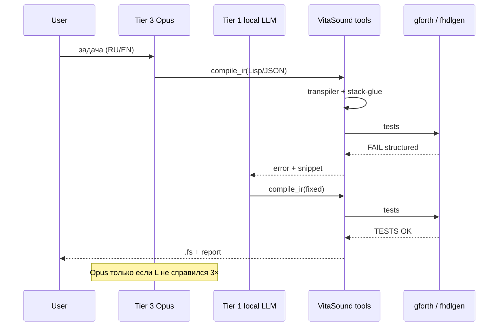

# Архитектура: внешний мощный LLM + VitaSound toolchain

Как использовать **Cursor Opus**, Claude, GPT и другие **дорогие облачные модели** в связке с **frules** и детерминированным toolchain (fmix, gforth, fhdlgen, transpiler, stack-glue) — без траты Opus на postfix и бесконечные Agent-циклы.

**Статус:** целевая архитектура продукта (v1). Часть backend ещё в разработке — см. [`TODO.md`](../TODO.md) «IR-пайплайн», «MCP server».

Связано: [`AI-KNOWLEDGE-INDEX.md`](AI-KNOWLEDGE-INDEX.md), [`AI-VS-TOOLS.md`](AI-VS-TOOLS.md), [`RULES-ARCHITECTURE.md`](RULES-ARCHITECTURE.md), [`OLLAMA-FRULES.md`](OLLAMA-FRULES.md), [`ML-GLOSSARY-FORTH.md`](ML-GLOSSARY-FORTH.md), [`TRACK-A-FINAL.md`](TRACK-A-FINAL.md), [`ROADMAP-AI-PLATFORM.md`](ROADMAP-AI-PLATFORM.md).

---

## Принцип

| Роль | Кто |
|------|-----|
| **Оркестратор** — смысл, алгоритм, архитектура, trade-offs, IR | Внешний мощный LLM (Opus и аналоги) **или** человек |
| **Компилятор + CI** — postfix, stack glue, синтаксис, тесты, emit | **Статический toolchain** + локальная модель |
| **Судья** | `gforth`, `T{ }T`, `fmix test`, golden `.v`, `flint` |

**Opus не заменяется** — он **не должен** быть внутренним циклом компилятора. Track A показал: учить маленькую модель Forth postfix дорого и бесполезно; правильная ставка — **вынести postfix из биллинга Opus**.

---

## Слои (tier model)

```text
┌─────────────────────────────────────────────────────────────┐
│  Tier 3 — Escalation                                        │
│  Opus / Claude thinking (короткие turns, без Agent-марафона)│
│  Архитектура, неоднозначное ТЗ, cross-repo, fhdlgen IR      │
└───────────────────────────┬─────────────────────────────────┘
                            │ только если Tier 1–2 не справились
┌───────────────────────────▼─────────────────────────────────┐
│  Tier 2 — Bulk coding (Cursor Composer / Auto)              │
│  scripts, yaml, docs, refactor, fmix fixes, CI              │
└───────────────────────────┬─────────────────────────────────┘
                            │
┌───────────────────────────▼─────────────────────────────────┐
│  Tier 1 — Local loop ($0 API)                               │
│  Gemma / Qwen + frules SYSTEM (core); Ollama                │
│  IR-черновик, RAG manual, smoke challenges, compile retries│
└───────────────────────────┬─────────────────────────────────┘
                            │
┌───────────────────────────▼─────────────────────────────────┐
│  Tier 0 — Deterministic                                     │
│  lisp-to-forth, stack-glue, gforth, flint, fcov, fmix, fhdlgen│
└─────────────────────────────────────────────────────────────┘
```

### Когда звать Opus (Tier 3)

- Постановка задачи на RU/EN с неочевидными edge cases.
- Выбор алгоритма и структуры слов / модулей.
- Заполнение **IR** (Lisp, JSON AST, fhdlgen API) — **не** финальный Forth postfix.
- Ревью factoring, `does>`, co-design железо + софт.
- Один короткий turn после structured FAIL от tool (логика IR, не `rot rot`).

### Когда **не** звать Opus

- Прогон `gforth` / `./test.sh` / `fmix test` — Tier 0.
- Исправление баланса стека между ops — **stack-glue**, Tier 0.
- Infix → RPN, обход AST — **transpiler**, Tier 0.
- Smoke на train challenges — Gemma + rules, Tier 1.
- Lint, coverage, semver — Tier 0.

---

## Целевой pipeline (v1)

```text
User intent
    │
    ▼
Tier 3 Opus (опционально) ──► постановка + IR v1
    │
    ▼
Tier 1 local LLM + frules SYSTEM ──► IR refine, RAG § manual
    │
    ▼
Tier 0  compile_ir ──► transpiler + stack-glue ──► .fs
    │
    ▼
Tier 0  run_gforth / fmix test ──► { PASS | structured FAIL }
    │
    ├── FAIL (stack/syntax) ──► Tier 0 правит glue; без Opus
    ├── FAIL (logic)          ──► Tier 1 правит IR; Opus если 3× fail
    └── PASS ──► flint / fcov ──► commit
```

Для **HDL** — заменить `compile_ir` → `fhdlgen_fill_ir` + `emit_verilog` + golden diff.



---

## frules в этой архитектуре

| Механизм | Где живёт | Назначение |
|----------|-----------|------------|
| `.cursor/rules/*.mdc` | Cursor Tier 2–3 | Стиль, stack habits, anti-patterns |
| `output/frules-ollama-system-core.txt` | Tier 1 Ollama SYSTEM | Короткий rules (~560 строк), не full 2k |
| RAG по `gforth-manual/` | Tier 0 tool или Tier 1 | § struct, exception — **без** hold-out slug |
| `eval_holdout` (53) | Tier 0 judge only | Opus/local — eval, gold и RAG по slug **запрещены** |

Rules — **не** замена transpiler. Rules говорят модели *что не писать*; tool *доказывает*, что код верен.

---

## Будущий MCP / Cursor skill (TODO)

Opus и Cursor Agent должны вызывать toolchain **как tool**, а не генерировать Forth в markdown.

| Tool (черновик) | Действие |
|-----------------|----------|
| `compile_ir` | Lisp / JSON / Python ast → `.fs` via transpiler + stack-glue |
| `run_gforth` | `gforth` + `T{ }T`; вернуть JSON `{ status, word, stack, log }` |
| `run_challenge` | slug из `tests/challenges/`; только eval slice |
| `fmix_test` | `fmix test` в текущем проекте |
| `flint_check` | lint дерева `.4th` |
| `fhdlgen_emit` | IR → Verilog → diff golden |
| `rag_manual` | top-k из `gforth-manual/` (exclude hold-out) |

Skill/rule для Agent: **алгоритм через `compile_ir`**, не сырой `: word` для нетривиальной логики.

---

## Экономика API (cost gate)

Типичный Agent-цикл «Opus пишет Forth → fail → переписывает» — **десятки–сотни тысяч tokens** на одну задачу.

Целевой контур:

| Этап | Модель | Порядок tokens |
|------|--------|----------------|
| Постановка + IR | Opus 1–2 Ask turns | ~5k–20k |
| Compile/test loop | Tier 0 + Tier 1 | ~$0 |
| Escalation | Opus 1 turn по structured error | ~5k–15k |

**Guardrails (рекомендуется):**

- Monthly on-demand cap в Cursor — до комфортного порога.
- Agent на весь репо — только при **закрытой** задаче; иначе Composer.
- Opus **thinking-xhigh** — только architecture / IR design, не regression loop.
- Hold-out eval — метрика «Opus + toolchain», не «Opus написал похоже на Forth».

---

## Экосистема VitaSound (репозитории)

| Repo | Роль в architecture |
|------|---------------------|
| **frules** | rules, challenges, eval, training docs |
| **fmix** | `new`, `packages.get`, `test` — структура проекта |
| **flint** | lint после codegen |
| **fcov** | coverage после `fmix test` |
| **fhdlgen** | IR → Verilog; Opus заполняет IR |
| **f**, **ttester**, **fenum**, **fsemver** | libs и tooling в deps |

Публичная серия статей (dev.to → Hackaday) — **та же архитектура**, рассказанная для людей: [FMix](https://dev.to/ua3mqj/fmix-a-package-manager-for-forth-37ld) → frules → fhdlgen → железо (KU5P, inference).

---

## Что уже работает vs в планах

| Компонент | Статус |
|-----------|--------|
| frules rules + `./install.sh` | ✓ |
| Ollama SYSTEM core/full | ✓ |
| 151 challenges + eval slices | ✓ |
| Track A 0.5B LoRA | ✓ закрыт — не путь для postfix |
| Gemma baseline | ✓ [`LOCAL-GEMMA-BENCHMARK.md`](LOCAL-GEMMA-BENCHMARK.md) |
| `lisp-to-forth`, `stack-glue` | ☐ прототип |
| MCP server | ☐ [`TODO.md`](../TODO.md) |
| Cost metrics (turns before/after tool) | ☐ измерить на gcd/factorial |

---

## Антипаттерны

1. **Opus как компилятор** — длинный Agent, правка `rot`/`pick` без gforth в loop.
2. **LoRA вместо rules** для daily coding — rules дешевле и сильнее на 0.5B.
3. **RAG по hold-out slug** — завышенная метрика.
4. **Сырой Forth от Tier 3** для алгоритма — обход stack-glue; вернуться к IR.
5. **Verilog «из головы»** — миновать fhdlgen и golden.

---

## Ссылки для агента

При работе в Cursor с Opus/Composer:

1. Прочитать [`AI-VS-TOOLS.md`](AI-VS-TOOLS.md) — таблица «ИИ vs статика».
2. Алгоритм → IR → tool (когда появится) → `gforth`.
3. Архитектура системы Forth / FMAP — `docs/FORTH-*.md`, не challenge rules.
4. Eval — [`CHALLENGE-TO-TRAIN.md`](CHALLENGE-TO-TRAIN.md), slice `eval_holdout`.
