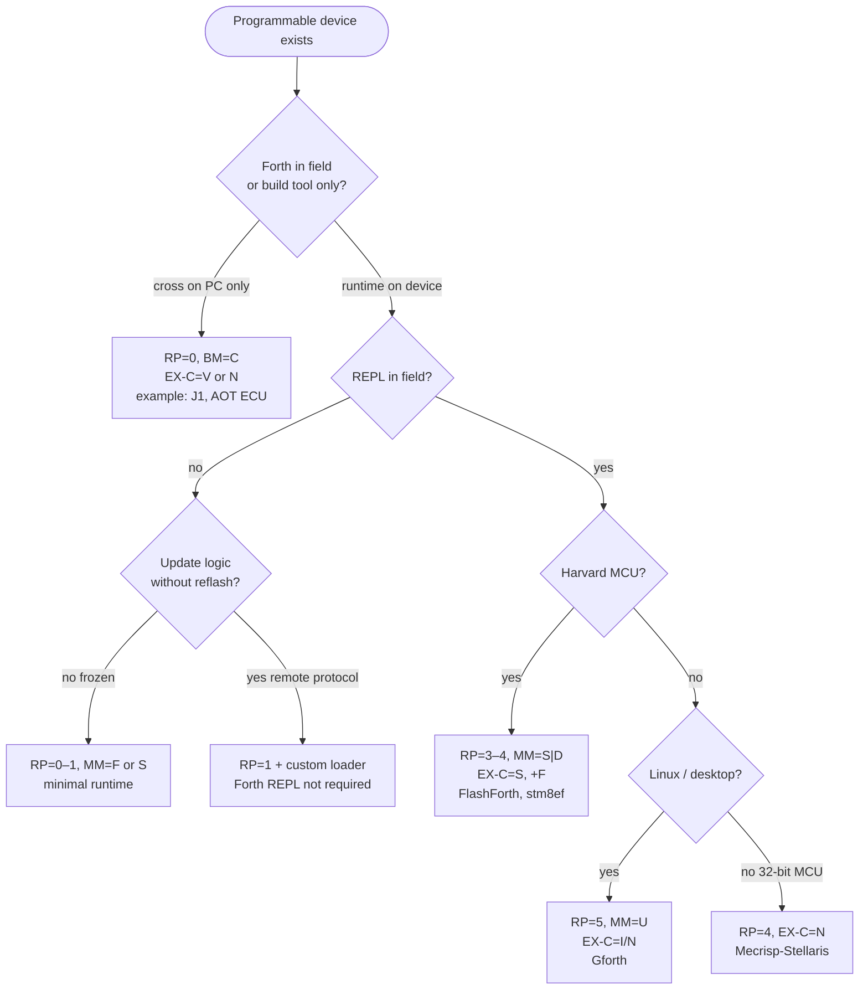
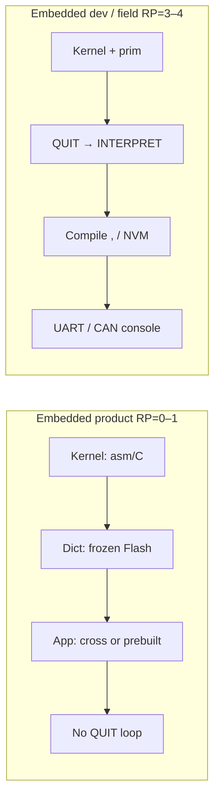
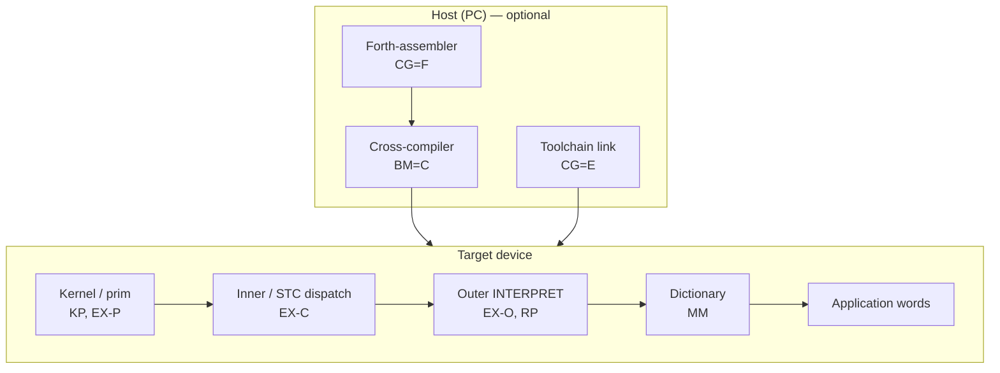

# Using FMAP: Choosing Forth for a Task

> **Russian:** [FORTH-FMAP-GUIDE.md](FORTH-FMAP-GUIDE.md)

Practical guide: **from domain → system profile → existing Forth or port requirements**.

**Classification scheme:** [FMAP / FTAS](FORTH-SYSTEM-ARCHITECTURE-eng.md#2-fmap--ftas-classification)  
**Data:** [`forth-fmap-profiles.json`](../data/forth-fmap-profiles.json), [`forth-use-case-templates.json`](../data/forth-use-case-templates.json)  
**Threaded code:** [FORTH-THREADING-eng.md](FORTH-THREADING-eng.md) · **Feature cost:** [FORTH-FEATURE-COMPLEXITY-eng.md](FORTH-FEATURE-COMPLEXITY-eng.md)

---

## Contents

1. [Idea in 2 minutes](#1-idea-in-2-minutes)
2. [Step-by-step algorithm](#2-step-by-step-algorithm)
3. [Main decision graph](#3-main-decision-graph)
4. [Axes: questions to ask yourself](#4-axes-questions-to-ask-yourself)
5. [Domains and profiles](#5-domains-and-profiles)
6. [Examples: task → FMAP](#6-examples-task--fmap)
7. [Examples: known systems dissected](#7-examples-known-systems-dissected)
8. [System modules: what lives where](#8-system-modules-what-lives-where)
9. [Forth features vs task](#9-forth-features-vs-task)
10. [Checklist before choosing](#10-checklist-before-choosing)
11. [For dataset and AI](#11-for-dataset-and-ai)

---

## 1. Idea in 2 minutes

**Forth is a family of systems**, not one product. A smartphone, engine ECU, and STM8 sensor *can* all use Forth, but:

| Device | Typical Forth | Why not “the same Gforth” |
|------------|----------------|---------------------------|
| Smartphone (hosted) | Gforth / SwiftForth | OS, FILE, full ANS, REPL |
| ECU (product) | cross → frozen image, RP=0–1 | certification, no field console |
| ECU (development) | Mecrisp / hosted cross + CAN REPL | debug, compile to Flash |
| AVR sensor | FlashForth, RP=4 | REPL over UART, little RAM |
| Firmware without REPL | AOT blob, RP=0 | minimal runtime |
| FPGA datapath | J1, RP=0 | Forth only on host |
| Browser / WASM REPL | WAForth, RP≈3 | sandbox, ~15 KB module; not Gforth |
| Custom ECU / NN control FPGA | co-design, RP=0 | see [HARDWARE-CODESIGN](FORTH-HARDWARE-CODESIGN-eng.md) |

**FMAP** encodes *which* Forth you need: memory (MM), execution (EX), runtime capabilities (RP), build (CG/BM), etc.

**ANS** defines the *portable algorithm layer* — one `: gcd` or `: heapsort` can run on Gforth, FlashForth, and custom FPGA with matching wordsets. See **[FORTH-ANS-PORTABILITY-LAYER-eng.md](FORTH-ANS-PORTABILITY-LAYER-eng.md)**.

You **do not** need to know every axis upfront. Answering **4–5 questions about the task** is enough — the rest follows from the tables below.

---

## 2. Step-by-step algorithm

### Step A — Fix the task (not the CPU)

Write down:

1. **Where does code live after deploy?** (RAM / Flash / cross-only)
2. **REPL in the field?** (UART, CAN shell, factory only)
3. **Who changes logic?** (developer / user / nobody)
4. **Hard limits?** (Flash KB, RAM bytes, deterministic timing)
5. **Integration?** (bare MCU / RTOS / Linux / FPGA)

### Step B — Choose **RP** (runtime profile)

| Your answer | RP |
|-----------|-----|
| Prebuilt firmware only, reset → `main` | **0–1** |
| REPL present, dictionary read-only | **2** |
| REPL + compile to RAM (dev board) | **3** |
| REPL + compile to Flash (field update) | **4** |
| Full desktop Forth (FORGET, vocabs, meta) | **5** |

### Step C — Choose **MM** from hardware

| Hardware | MM |
|--------|-----|
| Linux / Windows / large unified RAM | **U** |
| MCU Flash code + RAM data | **S** |
| Separate RAM-dict and Flash-dict (stm8ef) | **D** |
| Image frozen, no growth in field | **F** |
| Soft-CPU / stack silicon | **V** |

### Step D — Choose **EX-C** (colon word model)

See [FORTH-THREADING-eng.md](FORTH-THREADING-eng.md). Briefly:

| Condition | EX-C |
|---------|------|
| Harvard 8-bit MCU, Flash compile | **S** (STC) |
| Retro 6502/Z80 with REPL | **S** or **I** |
| 32-bit MCU, need speed | **N** |
| Desktop / full meta | **I** or **D** |
| FPGA, Forth only at build time | **V** |

### Step E — Build the string and find nearest profile

```
FMAP/<your-project>: MM-EX-O/EX-C/EX-P-RP-CG  [+tags]
```

Compare with [`forth-fmap-profiles.json`](../data/forth-fmap-profiles.json) or [`forth-use-case-templates.json`](../data/forth-use-case-templates.json).

### Step F — Add **features** (wordsets)

Per [FORTH-FEATURE-COMPLEXITY-eng.md](FORTH-FEATURE-COMPLEXITY-eng.md): locals, FILE, FP — only if RP and Flash/RAM allow.

---

## 3. Main decision graph



### Graph: embedded **without** vs **with** REPL



**Key difference:** RP=0–1 does not require a text interpreter in ROM; RP=4 requires the **full compile path** + often **NVM writer** (+Flash).

---

## 4. Axes: questions to ask yourself

| Axis | User question | “Yes” → | “No” → |
|-----|---------------------|--------|---------|
| **RP** | Interactive `: foo ;` on device? | 3–5 | 0–1 |
| **MM** | Code and data in one address space? | U | S or D |
| **EX-C** | Is STC speed enough on this CPU? | S | N (32-bit) or I (desktop) |
| **+F** | Save new words to Flash? | tag +F | RAM-only compile |
| **+C** | ISR and main in C, Forth as glue? | tag +C | pure Forth |
| **+L** | ANS locals / Gforth `{ }`? | tag +L | stack-only style |
| **CG** | Who generates machine code? | E/F/I/M | see [architecture §6](FORTH-SYSTEM-ARCHITECTURE-eng.md#6-build-and-codegen) |
| **NC** | Colon words → native peephole? | 2–3 | 0 (threaded only) |

---

## 5. Domains and profiles

Templates in [`forth-use-case-templates.json`](../data/forth-use-case-templates.json). Summary table:

| Domain | Device | RP | MM | EX-C | Typical systems | Tags |
|---------|------------|-----|-----|------|------------------|------|
| **Bare-metal sensor** | AVR/PIC/STM8 | 4 (dev) → 1 (ship) | S/D | S | FlashForth, stm8ef, AmForth | +F +B |
| **ECU / actuator** | Cortex-M, RH850 | 0–1 ship, 4 lab | S | N or S | Mecrisp, custom cross | +C +F |
| **Industrial HMI panel** | ARM Linux | 5 or 2 | U | I/N | Gforth, SwiftForth | +L FILE |
| **Smartphone / desktop tool** | ARM64/x64 + OS | 5 | U | I/N | Gforth | +L FILE |
| **Browser / WebAssembly** | WASM + host shim | 3 | U | S | WAForth | — |
| **Retro / hobby** | 6502, Z80 | 4 | U/S | S | TaliForth2, Cerberus | — |
| **FPGA accelerator** | ICE40, Xilinx | 0 | V | V | J1, Mecrisp-Ice | — |
| **Custom silicon / co-design** | FPGA ASIC, TTL lab | 0–2 | V | V | J1 + custom Verilog | see [HARDWARE-CODESIGN](FORTH-HARDWARE-CODESIGN-eng.md) |
| **Teaching** | any | 3–5 | U | I | Gforth, eForth bootstrap | — |
| **Space / cert** | rad-hard, frozen | 0–1 | F | S/N | custom AOT | — |

### One domain — two Forths (ECU)

Typical **two-phase** scheme:

| Phase | RP | Where | Why |
|------|-----|-----|-------|
| **Lab / calib** | 4 | dev ECU or HIL | REPL, compile, logging |
| **Series production** | 0–1 | flash ECU | app + kernel only, no QUIT |

FMAP **changes between phases** — that is normal. Do not try to carry RP=5 onto a production unit.

---

## 6. Examples: task → FMAP

### Example 1 — Temperature sensor, STM8, UART for debug

**Task:** field firmware without REPL; factory UART and ability to add words to Flash.

| Step | Decision |
|-----|---------|
| RP product | **1** (autostart) |
| RP factory | **4** (same binary or separate build) |
| MM | **D** (RAM dict + NVM) |
| EX-C | **S** |
| Tags | **+F +B +C** (board profile, C main) |

```
FMAP/sensor-stm8: D-M-S-A-1/4-E  NC=0  +C+F+B
Nearest profile: stm8ef
```

**Do not use:** Gforth `{ locals }`, FILE wordset, full ANS Exception.

---

### Example 2 — Engine ECU (Cortex-M4)

**Task:** hard realtime, certification, in-vehicle frozen app only; lab REPL over CAN.

| Step | Decision |
|-----|---------|
| Series | **RP=0**, **MM=S**, **EX-C=N**, **frozen** |
| Lab | **RP=4**, compile Flash, Mecrisp-class |
| BM | **C** (cross) + **T** (lab firmware) |
| Tags | **+C** (drivers in C) |

```
FMAP/ecu-lab:    S-M-N-G-4-M  NC=3  +C+F
FMAP/ecu-series: S-C-N-G-0-E  NC=3  +C     (cross-only ship)
Nearest profile: mecrisp-stellaris (lab)
```

**Features:** stack-only or slim locals; **no** full FILE; FP — only with FPU and Flash headroom ([complexity doc](FORTH-FEATURE-COMPLEXITY-eng.md)).

---

### Example 3 — Linux utility (“Forth script”)

**Task:** log parsing, CLI, fast development.

| Step | Decision |
|-----|---------|
| RP | **5** |
| MM | **U** |
| EX-C | **I** (Gforth engine) |
| BM | **N** (self-host) |

```
FMAP/log-tool: U-M-I-G-5-M  +L
Nearest profile: gforth
```

**Features:** `{ locals }`, `pathstring`, FILE, optionally `libcc` / C bindings.

---

### Example 4 — Smartphone (Android/Linux userland)

**Task:** embedded Forth *as a process*, not replacing the OS.

| Step | Decision |
|-----|---------|
| RP | **5** (or **2** read-only teaching image) |
| MM | **U** |
| Runtime | **hosted Gforth** in chroot / Termux |
| Do not confuse | this is **not** RP=4 Harvard; MM=U, full OS underneath |

```
FMAP/android-forth: U-M-I-G-5-M  +L
Nearest profile: gforth
```

On a phone **do not** look for STC/FlashForth — that is a different class (4 hosted).

---

### Example 5 — FPGA module on a PCIe card

**Task:** datapath on soft-CPU; host loads image.

| Step | Decision |
|-----|---------|
| RP | **0** |
| MM | **V** |
| EX-C | **V** |
| BM | **C** (cross.fs on PC) |

```
FMAP/fpga-slot: V-C-V-A-0-I
Nearest profile: j1, mecrisp-ice
```

---

## 7. Examples: known systems dissected

How to **read** someone else’s FMAP and check fit for your task.

### stm8ef → your task “MCU + REPL + Flash words”

```
FMAP/stm8ef: D-S-A-M-4-E  +C+F+B
```

| Axis | Value | Fits you if… |
|-----|----------|-------------------|
| MM=D | dual dict | you need RAM *and* NVM words |
| EX-C=S | STC | OK with CALL chain, no ITC meta |
| RP=4 | REPL + Flash compile | need `: ;` in field |
| +F | Flash compile | yes |
| +C | C integration | main/ISR in C |

**Does not fit if:** you need full ANS, locals, or RP=0 product-only without compile stack.

### Gforth → “my embedded”

```
FMAP/gforth: U-I-N-M-5-M  +L
```

**Use for:** host cross, Linux utilities, teaching, frules challenges.  
**Do not flash as-is on STM8** — different MM, RP, EX-C.

---

## 8. System modules: what lives where

Any Forth splits into **blocks**. When choosing or porting, decide per block: *needed in ROM? RAM? PC only?*



| Block | RP=0 product | RP=4 embedded REPL | RP=5 desktop |
|------|--------------|-------------------|--------------|
| Kernel (asm) | Flash, minimal | Flash | OS + dynasm |
| Inner/STC | STC or native | STC | ITC/NEXT |
| Outer / QUIT | **no** | **yes** | **yes** |
| Compile `,` | host only | target Flash/RAM | target RAM |
| Dictionary | frozen | RAM + NVM | heap |
| App | prebuilt | interactive | interactive |

---

## 9. Forth features vs task

FMAP describes **runtime architecture**. **Wordsets** are a separate layer ([FORTH-FEATURE-COMPLEXITY-eng.md](FORTH-FEATURE-COMPLEXITY-eng.md)).

| Feature | Sensor RP=1 | ECU RP=0 | Dev board RP=4 | Desktop RP=5 |
|------|-------------|----------|----------------|--------------|
| `: ;` compile | host | host | **target** | target |
| `{ locals }` | rare | no | optional | yes |
| `DEFER` / vocabs | no | no | sometimes | yes |
| FILE | no | no | rare | yes |
| FP | no | if needed | if FPU | yes |
| `SEE` / debug | sim only | no | UART | yes |
| C bindings +C | often | **yes** | **yes** | libcc |

**Rule:** **RP and MM** first, then features. Adding locals on RP=1 Harvard is a port project, not “flip a flag”.

---

## 10. Checklist before choosing

- [ ] **Lifecycle** recorded: lab firmware vs ship firmware (may be two FMAPs)
- [ ] **RP** chosen (REPL yes/no in field)
- [ ] **MM** matches CPU (Harvard → do not assume unified `HERE ,`)
- [ ] **EX-C** chosen (STC vs native vs ITC) — [FORTH-THREADING-eng.md](FORTH-THREADING-eng.md)
- [ ] **Nearest profile** checked in JSON
- [ ] **Wordset** list not wider than Flash/RAM and RP allow
- [ ] Clearly noted what **does not** port from Gforth (dialect)
- [ ] For AI/team: FMAP string in project README or system prompt

---

## 11. For dataset and AI

When generating Forth for a specific device, include **use case id** from JSON:

```json
{
  "use_case": "embedded-field-repl",
  "fmap_target": { "rp": 4, "mm": "S", "ex_c": "S", "tags": ["+F"] },
  "profile_hint": "flashforth"
}
```

See [`forth-use-case-templates.json`](../data/forth-use-case-templates.json).

**System prompt (template):**

```text
Use case: ECU lab firmware (embedded-field-repl).
Target FMAP: MM=S RP=4 EX-C=N +C+F. Not Gforth desktop.
Dialect: Mecrisp-Stellaris subset. Stack-first; no { locals } unless stated.
```

---

## Related documents

| Document | When to read |
|----------|--------------|
| [FORTH-SYSTEM-ARCHITECTURE-eng.md](FORTH-SYSTEM-ARCHITECTURE-eng.md) | Axis reference, CPU catalog |
| [FORTH-THREADING-eng.md](FORTH-THREADING-eng.md) | Choosing ITC/DTC/STC |
| [FORTH-FEATURE-COMPLEXITY-eng.md](FORTH-FEATURE-COMPLEXITY-eng.md) | Which features you can actually add |
| [forth-portability.mdc](../rules/forth-portability.mdc) | Porting application code |

---

*Hand-authored for frules.*
