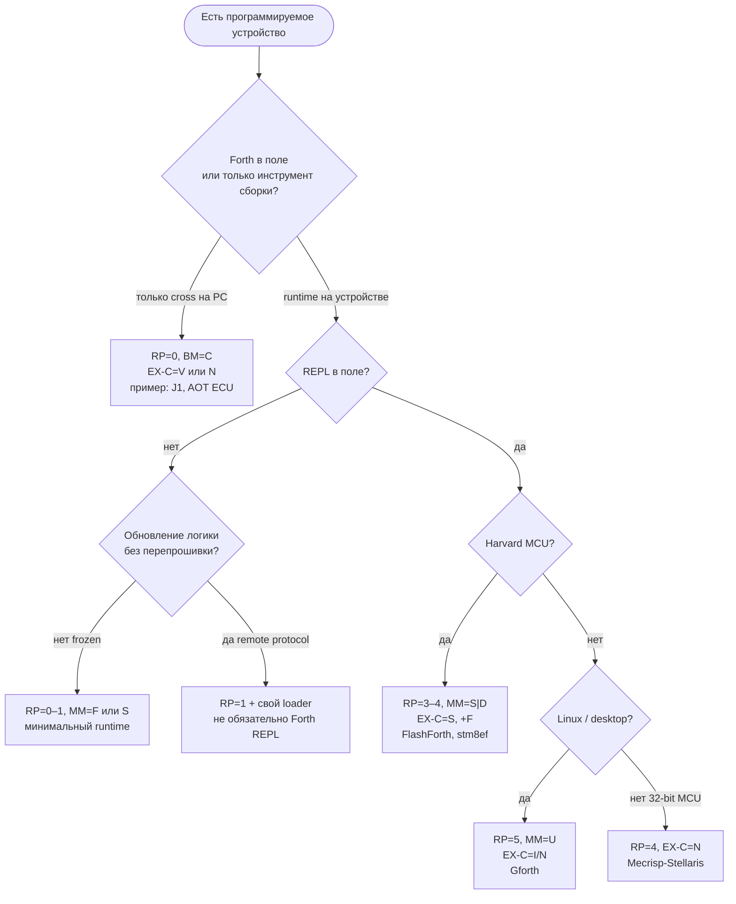
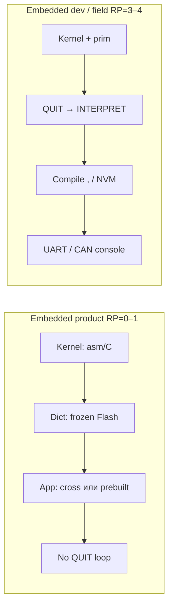
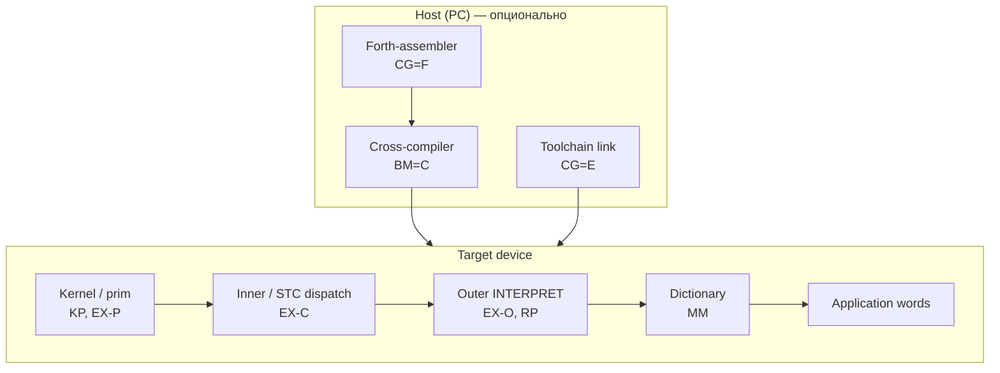

# Как пользоваться FMAP: выбор Forth под задачу

> **English:** [FORTH-FMAP-GUIDE-eng.md](FORTH-FMAP-GUIDE-eng.md)

Практическое руководство: **от предметной области → к профилю системы → к готовому Forth или к требованиям к своему порту**.

**Схема классификации:** [FMAP / FTAS](FORTH-SYSTEM-ARCHITECTURE.md#2-классификация-fmap--ftas)  
**Данные:** [`forth-fmap-profiles.json`](../data/forth-fmap-profiles.json), [`forth-use-case-templates.json`](../data/forth-use-case-templates.json)  
**Шитый код:** [FORTH-THREADING.md](FORTH-THREADING.md) · **Стоимость фич:** [FORTH-FEATURE-COMPLEXITY.md](FORTH-FEATURE-COMPLEXITY.md)

---

## Содержание

1. [Идея за 2 минуты](#1-идея-за-2-минуты)
2. [Пошаговый алгоритм](#2-пошаговый-алгоритм)
3. [Главный граф решений](#3-главный-граф-решений)
4. [Оси: что спрашивать у себя](#4-оси-что-спрашивать-у-себя)
5. [Предметные области и профили](#5-предметные-области-и-профили)
6. [Примеры: от задачи к FMAP](#6-примеры-от-задачи-к-fmap)
7. [Примеры: разбор известных систем](#7-примеры-разбор-известных-систем)
8. [Модули системы: что где живёт](#8-модули-системы-что-где-живёт)
9. [Фичи Forth vs задача](#9-фичи-forth-vs-задача)
10. [Чеклист перед выбором](#10-чеклист-перед-выбором)
11. [Для датасета и ИИ](#11-для-датасета-и-и)

---

## 1. Идея за 2 минуты

**Forth — семейство систем**, не один продукт. Смартфон, ECU двигателя и STM8-датчик *могут* быть на Forth, но:

| Устройство | Типичный Forth | Почему не «тот же Gforth» |
|------------|----------------|---------------------------|
| Смартфон (hosted) | Gforth / SwiftForth | OS, FILE, полный ANS, REPL |
| ECU (product) | cross → frozen image, RP=0–1 | сертификация, нет консоли в поле |
| ECU (development) | Mecrisp / hosted cross + CAN REPL | отладка, compile в Flash |
| Датчик на AVR | FlashForth, RP=4 | REPL по UART, мало RAM |
| Прошивка без REPL | AOT blob, RP=0 | минимальный runtime |
| FPGA datapath | J1, RP=0 | Forth только на host |
| Custom ECU / NN control FPGA | co-design, RP=0 | см. [HARDWARE-CODESIGN](FORTH-HARDWARE-CODESIGN.md) |

**FMAP** кодирует *какой именно* Forth нужен: память (MM), исполнение (EX), возможности runtime (RP), сборка (CG/BM) и т.д.

**ANS** задаёт *переносимый слой алгоритмов* — один `: gcd` или `: heapsort` может работать на Gforth, FlashForth и custom FPGA при совпадающих wordsets. См. **[FORTH-ANS-PORTABILITY-LAYER.md](FORTH-ANS-PORTABILITY-LAYER.md)**.

Вы **не обязаны** знать все оси сразу. Достаточно ответить на 4–5 вопросов о **задаче** — остальное следует из таблиц ниже.

---

## 2. Пошаговый алгоритм

### Шаг A — Зафиксировать задачу (не CPU)

Запишите:

1. **Где код живёт после деплоя?** (RAM / Flash / cross-only)
2. **Нужен ли REPL в поле?** (UART, CAN shell, только на заводе)
3. **Кто меняет логику?** (разработчик / пользователь / никто)
4. **Жёсткие лимиты?** (Flash KB, RAM bytes, deterministic timing)
5. **Интеграция?** (голый MCU / RTOS / Linux / FPGA)

### Шаг B — Выбрать **RP** (runtime profile)

| Ваш ответ | RP |
|-----------|-----|
| Только заранее собранная прошивка, reset → `main` | **0–1** |
| REPL есть, но словарь read-only | **2** |
| REPL + compile в RAM (dev board) | **3** |
| REPL + compile в Flash (field update) | **4** |
| Полный desktop Forth (FORGET, vocabs, meta) | **5** |

### Шаг C — Выбрать **MM** по железу

| Железо | MM |
|--------|-----|
| Linux / Windows / большой unified RAM | **U** |
| MCU Flash code + RAM data | **S** |
| Отдельно RAM-dict и Flash-dict (stm8ef) | **D** |
| Образ заморожен, в поле не растёт | **F** |
| Soft-CPU / stack silicon | **V** |

### Шаг D — Выбрать **EX-C** (модель colon word)

См. [FORTH-THREADING.md](FORTH-THREADING.md). Кратко:

| Условие | EX-C |
|---------|------|
| Harvard 8-bit MCU, Flash compile | **S** (STC) |
| Retro 6502/Z80 с REPL | **S** или **I** |
| 32-bit MCU, нужна скорость | **N** |
| Desktop / полный meta | **I** или **D** |
| FPGA, Forth только при сборке | **V** |

### Шаг E — Собрать строку и найти близкий профиль

```
FMAP/<ваш-проект>: MM-EX-O/EX-C/EX-P-RP-CG  [+tags]
```

Сравните с [`forth-fmap-profiles.json`](../data/forth-fmap-profiles.json) или [`forth-use-case-templates.json`](../data/forth-use-case-templates.json).

### Шаг F — Добавить **фичи** (wordsets)

По [FORTH-FEATURE-COMPLEXITY.md](FORTH-FEATURE-COMPLEXITY.md): locals, FILE, FP — только если RP и Flash/RAM позволяют.

---

## 3. Главный граф решений



### Граф: embedded **без** REPL vs **с** REPL



**Ключевое различие:** RP=0–1 не требует text interpreter в ROM; RP=4 требует **весь compile path** + often **NVM writer** (+Flash).

---

## 4. Оси: что спрашивать у себя

| Ось | Вопрос пользователя | «Да» → | «Нет» → |
|-----|---------------------|--------|---------|
| **RP** | Нужен ли интерактивный `: foo ;` на устройстве? | 3–5 | 0–1 |
| **MM** | Code и data в одном адресном пространстве? | U | S или D |
| **EX-C** | Достаточно ли скорости STC на этом CPU? | S | N (32-bit) или I (desktop) |
| **+F** | Сохранять новые слова в Flash? | tag +F | RAM-only compile |
| **+C** | ISR и main на C, Forth как glue? | tag +C | чистый Forth |
| **+L** | ANS locals / Gforth `{ }`? | tag +L | stack-only стиль |
| **CG** | Кто генерирует machine code? | E/F/I/M | см. [architecture §6](FORTH-SYSTEM-ARCHITECTURE.md#6-сборка-и-codegen) |
| **NC** | Colon words → native peephole? | 2–3 | 0 (threaded only) |

---

## 5. Предметные области и профили

Шаблоны в [`forth-use-case-templates.json`](../data/forth-use-case-templates.json). Сводная таблица:

| Область | Устройство | RP | MM | EX-C | Типичные системы | Теги |
|---------|------------|-----|-----|------|------------------|------|
| **Bare-metal sensor** | AVR/PIC/STM8 | 4 (dev) → 1 (ship) | S/D | S | FlashForth, stm8ef, AmForth | +F +B |
| **ECU / actuator** | Cortex-M, RH850 | 0–1 ship, 4 lab | S | N или S | Mecrisp, custom cross | +C +F |
| **Industrial HMI panel** | ARM Linux | 5 или 2 | U | I/N | Gforth, SwiftForth | +L FILE |
| **Смартфон / desktop tool** | ARM64/x64 + OS | 5 | U | I/N | Gforth | +L FILE |
| **Retro / hobby** | 6502, Z80 | 4 | U/S | S | TaliForth2, Cerberus | — |
| **FPGA accelerator** | ICE40, Xilinx | 0 | V | V | J1, Mecrisp-Ice | — |
| **Custom silicon / co-design** | FPGA ASIC, TTL lab | 0–2 | V | V | J1 + custom Verilog | см. [HARDWARE-CODESIGN](FORTH-HARDWARE-CODESIGN.md) |
| **Teaching** | любой | 3–5 | U | I | Gforth, eForth bootstrap | — |
| **Space / cert** | rad-hard, frozen | 0–1 | F | S/N | custom AOT | — |

### Один домен — два Forth (ECU)

Типичная **двухфазная** схema:

| Фаза | RP | Где | Зачем |
|------|-----|-----|-------|
| **Lab / calib** | 4 | dev ECU или HIL | REPL, compile, логирование |
| **Series production** | 0–1 | flash ECU | только app + kernel, без QUIT |

FMAP **меняется между фазами** — это нормально. Не пытайтесь тащить RP=5 на серийный блок.

---

## 6. Примеры: от задачи к FMAP

### Пример 1 — Датчик температуры, STM8, UART для отладки

**Задача:** прошивка в поле без REPL; на заводе — UART и возможность дописать слова в Flash.

| Шаг | Решение |
|-----|---------|
| RP product | **1** (autostart) |
| RP factory | **4** (тот же binary или отдельный build) |
| MM | **D** (RAM dict + NVM) |
| EX-C | **S** |
| Теги | **+F +B +C** (board profile, C main) |

```
FMAP/sensor-stm8: D-M-S-A-1/4-E  NC=0  +C+F+B
Ближайший профиль: stm8ef
```

**Не брать:** Gforth `{ locals }`, FILE wordset, полный ANS Exception.

---

### Пример 2 — ECU двигателя (Cortex-M4)

**Задача:** жёсткий realtime, сертификация, в машине — только frozen app; в лаборатории — REPL по CAN.

| Шаг | Решение |
|-----|---------|
| Series | **RP=0**, **MM=S**, **EX-C=N**, **MM frozen** |
| Lab | **RP=4**, compile Flash, Mecrisp-class |
| BM | **C** (cross) + **T** (lab firmware) |
| Теги | **+C** (драйверы на C) |

```
FMAP/ecu-lab:    S-M-N-G-4-M  NC=3  +C+F
FMAP/ecu-series: S-C-N-G-0-E  NC=3  +C     (cross-only ship)
Ближайший профиль: mecrisp-stellaris (lab)
```

**Фичи:** stack-only или slim locals; **без** полного FILE; FP — только если есть FPU и запас Flash ([complexity doc](FORTH-FEATURE-COMPLEXITY.md)).

---

### Пример 3 — Утилита на Linux (аналог «скрипт на Forth»)

**Задача:** парсинг логов, CLI, быстрая разработка.

| Шаг | Решение |
|-----|---------|
| RP | **5** |
| MM | **U** |
| EX-C | **I** (Gforth engine) |
| BM | **N** (self-host) |

```
FMAP/log-tool: U-M-I-G-5-M  +L
Ближайший профиль: gforth
```

**Фичи:** `{ locals }`, `pathstring`, FILE, при необходимости `libcc` / C bindings.

---

### Пример 4 — Смартфон (Android/Linux userland)

**Задача:** embedded Forth *как процесс*, не замена OS.

| Шаг | Решение |
|-----|---------|
| RP | **5** (или **2** read-only teaching image) |
| MM | **U** |
| Runtime | **hosted Gforth** в chroot / Termux |
| Не путать | это **не** RP=4 Harvard; MM=U, полный OS под низом |

```
FMAP/android-forth: U-M-I-G-5-M  +L
Ближайший профиль: gforth
```

На телефоне **не** ищите STC/FlashForth — это другой класс (4 hosted).

---

### Пример 5 — FPGA модуль в PCIe карте

**Задача:** datapath на soft-CPU; host загружает образ.

| Шаг | Решение |
|-----|---------|
| RP | **0** |
| MM | **V** |
| EX-C | **V** |
| BM | **C** (cross.fs на PC) |

```
FMAP/fpga-slot: V-C-V-A-0-I
Ближайший профиль: j1, mecrisp-ice
```

---

## 7. Примеры: разбор известных систем

Как **читать** чужой FMAP и проверять fit для вашей задачи.

### stm8ef → ваша задача «MCU + REPL + Flash words»

```
FMAP/stm8ef: D-S-A-M-4-E  +C+F+B
```

| Ось | Значение | Вам подходит если… |
|-----|----------|-------------------|
| MM=D | dual dict | нужны RAM *и* NVM слова |
| EX-C=S | STC | ок с CALL-chain, не нужен ITC meta |
| RP=4 | REPL + Flash compile | нужен `: ;` в поле |
| +F | Flash compile | да |
| +C | C integration | main/ISR на C |

**Не подходит если:** нужен полный ANS, locals, или RP=0 product-only без compile stack.

### Gforth → «мой embedded»

```
FMAP/gforth: U-I-N-M-5-M  +L
```

**Берите для:** host cross, Linux utilities, обучение, челленджи frules.  
**Не прошивайте как есть на STM8** — другой MM, RP, EX-C.

---

## 8. Модули системы: что где живёт

Любой Forth можно разложить на **блоки**. При выборе/порте решайте по каждому блоку: *нужен в ROM? RAM? только на PC?*



| Блок | RP=0 product | RP=4 embedded REPL | RP=5 desktop |
|------|--------------|-------------------|--------------|
| Kernel (asm) | Flash, minimal | Flash | OS + dynasm |
| Inner/STC | STC или native | STC | ITC/NEXT |
| Outer / QUIT | **нет** | **да** | **да** |
| Compile `,` | host only | target Flash/RAM | target RAM |
| Dictionary | frozen | RAM + NVM | heap |
| App | prebuilt | interactive | interactive |

---

## 9. Фичи Forth vs задача

FMAP описывает **архитектуру runtime**. **Wordsets** — отдельный слой ([FORTH-FEATURE-COMPLEXITY.md](FORTH-FEATURE-COMPLEXITY.md)).

| Фича | Sensor RP=1 | ECU RP=0 | Dev board RP=4 | Desktop RP=5 |
|------|-------------|----------|----------------|--------------|
| `: ;` compile | host | host | **target** | target |
| `{ locals }` | редко | нет | опционально | да |
| `DEFER` / vocabs | нет | нет | иногда | да |
| FILE | нет | нет | редко | да |
| FP | нет | если нужно | если FPU | да |
| `SEE` / debug | sim only | no | UART | yes |
| C bindings +C | часто | **да** | **да** | libcc |

**Правило:** сначала **RP и MM**, потом фичи. Добавление locals на RP=1 Harvard — отдельный проект порта, не «включить флаг».

---

## 10. Чеклист перед выбором

- [ ] Записан **lifecycle**: lab firmware vs ship firmware (может быть два FMAP)
- [ ] Выбран **RP** (REPL да/нет в поле)
- [ ] **MM** согласован с CPU (Harvard → не assume unified `HERE ,`)
- [ ] **EX-C** выбран (STC vs native vs ITC) — [FORTH-THREADING.md](FORTH-THREADING.md)
- [ ] Проверен **ближайший профиль** в JSON
- [ ] Список **wordsets** не шире, чем Flash/RAM и RP позволяют
- [ ] Явно отмечено, что **не** переносится с Gforth (dialect)
- [ ] Для ИИ/команды: строка FMAP в README проекта или в system prompt

---

## 11. Для датасета и ИИ

При генерации Forth для конкретного устройства включайте **use case id** из JSON:

```json
{
  "use_case": "embedded-field-repl",
  "fmap_target": { "rp": 4, "mm": "S", "ex_c": "S", "tags": ["+F"] },
  "profile_hint": "flashforth"
}
```

См. [`forth-use-case-templates.json`](../data/forth-use-case-templates.json).

**System prompt (шаблон):**

```text
Use case: ECU lab firmware (embedded-field-repl).
Target FMAP: MM=S RP=4 EX-C=N +C+F. Not Gforth desktop.
Dialect: Mecrisp-Stellaris subset. Stack-first; no { locals } unless stated.
```

---

## Связанные документы

| Документ | Когда читать |
|----------|--------------|
| [FORTH-SYSTEM-ARCHITECTURE.md](FORTH-SYSTEM-ARCHITECTURE.md) | Справочник осей, каталог CPU |
| [FORTH-THREADING.md](FORTH-THREADING.md) | Выбор ITC/DTC/STC |
| [FORTH-FEATURE-COMPLEXITY.md](FORTH-FEATURE-COMPLEXITY.md) | Какие фичи реально добавить |
| [forth-portability.mdc](../rules/forth-portability.mdc) | Перенос прикладного кода |

---

*Hand-authored для frules. Шаблоны use case — [`data/forth-use-case-templates.json`](../data/forth-use-case-templates.json).*
