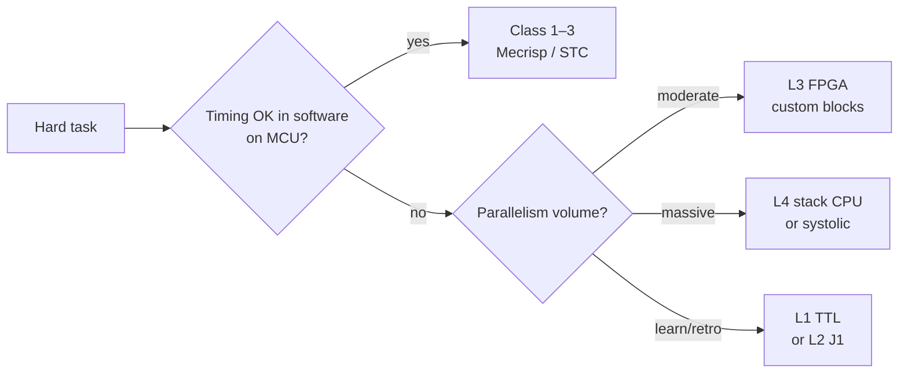
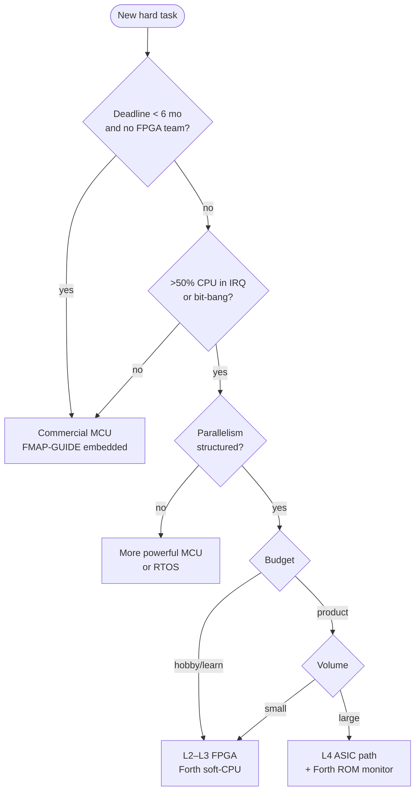

# Forth and Hardware Co-Design: A New Platform for the Task

> **Russian:** [FORTH-HARDWARE-CODESIGN.md](FORTH-HARDWARE-CODESIGN.md)

When the **task is harder** than “fit on an STM32”, it can make sense not only to pick an MCU and write C firmware, but to **design hardware together with the Forth model**: processor, peripherals, and language as one system.

**Related documents:** [FORTH-FMAP-GUIDE-eng.md](FORTH-FMAP-GUIDE-eng.md) · [FORTH-SYSTEM-ARCHITECTURE-eng.md](FORTH-SYSTEM-ARCHITECTURE-eng.md) (class **0**, MM=**V**) · [FORTH-ANS-PORTABILITY-LAYER-eng.md](FORTH-ANS-PORTABILITY-LAYER-eng.md) · [FORTH-FEATURE-COMPLEXITY-eng.md](FORTH-FEATURE-COMPLEXITY-eng.md) · [J1](https://github.com/jamesbowman/j1) · [`forth-use-case-templates.json`](../data/forth-use-case-templates.json)

---

## Contents

1. [Thesis](#1-thesis)
2. [When new hardware is justified](#2-when-new-hardware-is-justified)
3. [Why Forth, not “C compiler first”](#3-why-forth-not-c-compiler-first)
4. [Implementation spectrum](#4-implementation-spectrum)
5. [Co-design: hardware as Forth words](#5-co-design-hardware-as-forth-words)
6. [Domain examples](#6-domain-examples)
7. [Process: task to platform](#7-process-task-to-platform)
8. [FMAP for custom hardware](#8-fmap-for-custom-hardware)
9. [Decision graph: buy MCU or build](#9-decision-graph-buy-mcu-or-build)
10. [Risks and anti-patterns](#10-risks-and-anti-patterns)
11. [Historical precedents](#11-historical-precedents)
12. [For dataset and AI](#12-for-dataset-and-ai)

---

## 1. Thesis

A **programmable device** is not only CPU + program. It is:

- **time model** (interrupts, PWM, deadlines);
- **data model** (where samples, weights, register maps live);
- **extension model** (can you add a word in the field).

On a general MCU a hard task often becomes a **race for cycles**: polling sensors in sequence, soft PWM, DMA chains, RTOS. An alternative is to **move repetitive, timing-critical patterns into hardware** and keep control **structured** in Forth.

Forth here is not “another firmware language” but a **co-design tool**:

| Usual path | Forth co-design path |
|--------------|----------------------|
| CPU → GCC/toolchain → C runtime → app | CPU/soft-CPU → **cross-Forth on PC** → image |
| ISA fixed by vendor | ISA can be **Forth-friendly** |
| Peripherals = MMIO + C HAL | Peripherals = **primitives and `@`/`!`** |
| New silicon → compiler port | New silicon → **new opcodes in basewords.fs** |

**Unique opportunity:** you do not need **C compiler, libc, and ABI** on every experimental platform. A **cross-compiler Forth** (often the same Gforth/J1-style stack on the host) and a thin asm boundary are enough.

---

## 2. When new hardware is justified

### Co-design makes sense

| Signal | Explanation |
|--------|-----------|
| **Hard timing** | Dozens of PWM, triggers per cycle, cannot “poll in main loop” |
| **Mass parallelism** | Many identical channels (sensors, neurons, valves) |
| **Odd data shape** | Streaming where RAM bandwidth is the bottleneck |
| **Small series product** | FPGA/ASIC cheaper than “powerful MCU + support chips” |
| **Research / hobby** | Goal is to **understand the machine**, not ship millions |
| **Long lifecycle without OS** | Frozen firmware 20 years; simple runtime beats rich SDK |

### Off-the-shelf MCU is often enough

| Signal | Better |
|--------|-------|
| One UART, 2 ADC, 4 PWM | STM32 / MSP430 + Mecrisp |
| Need Linux, network, UI | Gforth / C on ARM SBC |
| Team knows only C | C toolchain already paid for |
| Time-to-market < 3 months | Commercial chip |
| Certification on standard SIL | Proven vendor MCU |

**Rule:** co-design wins when **cost of software complexity on a foreign ISA** exceeds **cost of narrow hardware + simple Forth runtime**.

---

## 3. Why Forth, not “C compiler first”

### What a new “bare” platform requires

```
Minimum for a C application:
  ISA spec → GCC/LLVM backend → libc → crt0 → linker scripts
  → debugger → calling convention → volatile MMIO headers …

Minimum for Forth co-design:
  ISA spec (can = Forth opcodes)
  → asm primitives (or Verilog CPU)
  → cross.fs on Gforth (host)
  → ~31 prim or J1-style basewords
  → image in ROM/FPGA
```

### What Forth gives on new hardware

| Property | Effect |
|----------|--------|
| **Postfix + stacks** | Simple decode in silicon; few registers |
| **Colon = composition** | App = dictionary; no linker hell |
| **Cross on host** | RP=0 in field; REPL not required |
| **Forth = ISA** (class 0) | `basewords.fs` **defines** the machine |
| **Peripherals as words** | `@`/`!` at fixed addresses — no HAL layers |
| **Bootstrap ~31 prim** | Kernel from small asm ([complexity doc](FORTH-FEATURE-COMPLEXITY-eng.md)) |
| **No mandatory libc** | No malloc, FILE, printf as prerequisite |

### What you still need (honestly)

- **Host Forth** (Gforth) for cross.
- **Asm/Verilog boundary:** prim entries, reset, stacks.
- **Memory map** and documented peripheral addresses.
- For FPGA: synthesis, timing closure; for TTL: months of wiring.

Forth **does not remove** hardware work — it **removes the C toolchain** from the critical path.

---

## 4. Implementation spectrum

From “transistors in the garage” to soft-CPU on FPGA — **one FMAP logic**, different budget.

| Level | Implementation | MM | BM | Typical RP | Notes |
|---------|------------|-----|-----|-------------|---------|
| **L0** | Transistors / logic without CPU | — | manual | — | Forth **only** as idea; need at least minimal stack mechanism |
| **L1** | TTL/PROM 1980s (7400 + EEPROM) | U/S | cross | 0–2 | Retro co-design; slow but transparent |
| **L2** | FPGA soft-CPU (J1, custom) | **V** | **C** | 0–1 | **Sweet spot** for experiment |
| **L3** | FPGA: CPU + custom datapath | **V** + MMIO | **C** | 0 | ECU, NN accelerator control |
| **L4** | ASIC / stack silicon | **V** | **C**→mask | 0–2 | NC4016, RTX, GreenArrays lineage |
| **L5** | MCU + FPGA coprocessor | S + V | **H** | 1–4 | Forth on MCU, hot path in FPGA |



---

## 5. Co-design: hardware as Forth words

### Principle

**Each hardware block** gets:

1. **Fixed address map** (or port index on stack-CPU).
2. **Stack effect** in docs: `( n -- )`, `( -- flag )`.
3. **Prim or colon** at the boundary; inside — hardware.

### Example: ECU — 16 hardware PWM + capture

**Bad (generic MCU):** one timer, soft queue, jitter.

**Co-design:**

```
Hardware:
  PWM_BANK[0..15]   @ !     \ period, duty per channel
  CAPTURE[0..7]     @       \ last edge timestamp (free-running timer snap)
  CRANK_SYNC        @       \ flag: tooth seen
  INJ_FIRE  n !             \ trigger injection channel n (one-shot hw)

Forth (colon, cross-compiled):
  : sync-injection ( channel duty -- )
      swap INJ_FIRE !  ... ;
```

The software model is **flat**: no HAL_Init, no NVIC maze — **words** mirror **registers** you designed.

### Example: NN — systolic array + Forth control

Forth **need not** “do matrix math”. Typical split:

| Layer | Where |
|------|-----|
| MAC array, weights FIFO | **Silicon / FPGA datapath** |
| Layer schedule, addr gen | **Microcode or simple FSM** |
| Experiment script, bring-up | **Forth cross on host → blob** |
| Runtime tweak (rare) | **Minimal prim set** on soft-CPU |

Forth controls **what and when**; hardware does **mass multiply**. FMAP: `MM=V` for control CPU, separate map for weight memory.

### Memory-mapped “sensor cells”

Idea: **do not poll ADC in a loop**; have **snapshot RAM** updated by hardware via DMA/sequencer:

```
SENSOR_CELL i @    \ last value channel i
SENSOR_VALID @     \ bitmask fresh channels
```

Forth reads **structured memory** like variables — timing decoupled.

---

## 6. Domain examples

### ECU / drive / power

| Hardware | Forth level |
|------------|---------------|
| Crank/cam decode HW | prim `CRANK@`, events in shared RAM |
| 12 injectors HW timed | `INJ!` — one operation |
| Knock bandpass filters | optional analog front + peak detect regs |
| Strategy | colon words: `: run-cylinder ;` cross → Flash |

**FMAP (series):** `S-F-N-G-0-E` or custom `V-V-A-0-I` on soft-CPU + MMIO block.  
**Lab phase:** same silicon + UART REPL → RP=2–4 on dev bitstream.

### Neural net / signal processing

| Criterion | Co-design |
|----------|-----------|
| Ops predictable, batch | Systolic, FIR in FPGA |
| Weights static | ROM/RAM port wide |
| Graph changes often | Host Gforth generates config tables |
| Field | RP=0 blob only |

Forth **does not replace** CUDA — it is a **cheap orchestrator** where Linux is excess.

**ANS + co-design:** control logic and strategy in an ANS subset port between host simulation and silicon; only `platform/` changes (prim, MMIO). See [FORTH-ANS-PORTABILITY-LAYER-eng.md](FORTH-ANS-PORTABILITY-LAYER-eng.md).

### Hobby: “1980s computer”

| Goal | Approach |
|------|--------|
| Understand CPU | 6502/Z80 + TaliForth/Cerberus (class 2) — **not** custom, but retro co-design |
| Understand **your** ISA | J1 on ICE40 (~200 LOC Verilog) |
| Extreme | TTL + EEPROM: Forth cross on PC only, PROM holds STC list |

Value here is **transparency**; FMAP records honest RP=0 and BM=C.

---

## 7. Process: task to platform

### Phase 1 — Domain decomposition

1. List **time-critical** operations (ns/µs).
2. List **throughput** (samples/s, MACs/s).
3. List **what changes** (calibration, strategy, topology).

Everything in 1–2 → **silicon** candidates. Item 3 → **Forth colon** on host cross.

### Phase 2 — ISA sketch

| Question | Forth-native answer |
|--------|-------------------|
| How many stacks? | Data + return (minimum) |
| Width? | 16-bit ECU; 18-bit J1; 32-bit if memory |
| Opcodes? | ALU + `@`/`!` + `call`/`ret` + lit |
| Peripherals? | Separate opcodes or unified `@`/`!` |

J1: [basewords.fs](https://github.com/jamesbowman/j1/blob/master/basewords.fs) — reference “Forth = opcode bits”.

### Phase 3 — Host toolchain

```
Gforth (host)
  cross.fs          \ target memory map
  targetwords.fs    \ prim aliases
  app.fs            \ your strategy
  → image.hex / bitstream init
```

**BM=C**, **CG=I** — Forth source **is** the ISA.

### Phase 4 — Bring-up

1. UART `?RX`/`TX!` prim — first contact.
2. `@`/`!` smoke test on LED regs.
3. Load image; no REPL in field (RP=0) — normal.

### Phase 5 — FMAP freeze

Document custom silicon FMAP string — see §8.

---

## 8. FMAP for custom hardware

For co-design projects define **your own id** like:

```
FMAP/my-ecu-fpga: V-M-V-A-0-I  MM=V+MMIO  NC=0  +C
  custom_blocks: pwm_bank,capture,inj_fire
  host_cross: gforth
  silicon: ice40 + custom verilog
```

| Axis | Custom hardware typically |
|-----|-------------------------|
| **MM** | **V** (opcode stream) + **MMIO** region for `@`/`!` |
| **EX-C** | **V** |
| **EX-P** | **A** (Verilog) or **G** |
| **RP** | **0** ship; **2** optional UART monitor |
| **CG** | **I** (basewords) + **E** (Verilog) |
| **BM** | **C** |
| **KP** | **V** or **M** |
| **NC** | **0** (threaded/colon = opcodes) |

Use case template: [`hardware-codesign`](../data/forth-use-case-templates.json) in JSON.

### MM=V + MMIO (hybrid memory)

Common L3 pattern:

- **Program:** Forth opcodes in BRAM/Flash (`MM=V`).
- **Peripherals:** fixed `@`/`!` addresses (`MMIO` — document in cross.fs, not a separate FMAP letter today; tag `+HW` in project notes).

---

## 9. Decision graph: buy MCU or build



### Matrix: task → strategy

| Task | Try first | Co-design if |
|--------|---------------------|----------------|
| ECU 4 cyl | Cortex-M + Mecrisp | >8 cyl, weird timing, no vendor timer fit |
| Motor FOC | Dedicated driver IC | Integrate driver + strategy in one FPGA |
| Tiny ML | CMSIS-NN on M4 | Custom quantised MAC array |
| NN lab board | GPU / RPi | Research chip, power budget W not kW |
| Retro CPU lab | Emulator | Physical insight needed |

---

## 10. Risks and anti-patterns

| Anti-pattern | Why bad |
|-------------|--------------|
| “Build our own CPU” without timing budget | Years on bring-up |
| Forth co-design **without** host cross | Hand-write opcodes in hex |
| Duplicate C HAL in Forth | Loses `@`/`!` simplicity |
| RP=5 on silicon | Meta not needed in ECU |
| Ignoring cert / safety | Custom ECU ≠ hobby FPGA |
| “Forth will speed up NN” without datapath | Forth = control, not tensor core |

**When co-design is the goal:** L1 TTL is OK as **pedagogy**; production ECU needs traceability (requirements → FMAP → tests).

---

## 11. Historical precedents

| System | Idea | Lesson |
|---------|------|------|
| **NC4016 / RTX2000** | Forth in silicon | Stack ops = instructions; extreme speed |
| **MuP21 / F21** | Moore multi-stack | Co-design language + silicon |
| **GreenArrays GA144** | Many tiny Forth cores | Parallelism + Forth native |
| **J1 / J1a** | Verilog Forth CPU | **Accessible** co-design today |
| **Mecrisp-Ice** | FPGA Forth | Cross-only, RP=0 |
| **8051-eForth / stm8ef** | *Not* custom CPU, but co-design **peripherals + STC** | Middle path on cheap MCU |

Modern **practical entry:** J1 or your soft-CPU on ICE40/ECP5 + Gforth cross — weeks, not years.

---

## 12. For dataset and AI

When describing a custom platform in training context:

```text
Platform: custom FPGA ECU (hardware-codesign).
FMAP: MM=V EX-C=V RP=0 CG=I BM=C — Forth opcodes, not ARM.
Peripherals: memory-mapped words PWM@ INJ! — not STM32 HAL.
Host: Gforth cross.fs generates image; no C compiler on target.
Do not suggest: libc, CMSIS, { locals } unless host-side script only.
```

JSON: `use_case: "hardware-codesign"` in [`forth-use-case-templates.json`](../data/forth-use-case-templates.json).

---

## Related frules document stack

| Question | Document |
|--------|----------|
| Choose an existing system | [FORTH-FMAP-GUIDE-eng.md](FORTH-FMAP-GUIDE-eng.md) |
| Axes and class 0 | [FORTH-SYSTEM-ARCHITECTURE-eng.md](FORTH-SYSTEM-ARCHITECTURE-eng.md) |
| Cost of locals/FILE | [FORTH-FEATURE-COMPLEXITY-eng.md](FORTH-FEATURE-COMPLEXITY-eng.md) |
| ITC vs STC (if not V) | [FORTH-THREADING-eng.md](FORTH-THREADING-eng.md) |

---

*Hand-authored for frules.*
