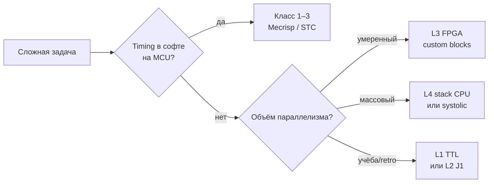
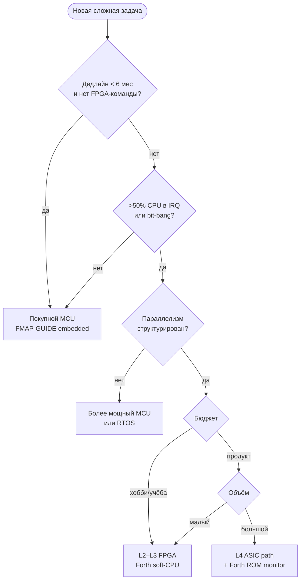

# Forth и co-design железа: новая платформа под задачу

> **English:** [FORTH-HARDWARE-CODESIGN-eng.md](FORTH-HARDWARE-CODESIGN-eng.md)

Когда **задача сложнее**, чем «влезть в STM32», имеет смысл не только выбрать MCU и написать прошивку на C, а **спроектировать аппаратуру вместе с Forth-моделью**: процессор, периферия и язык как одна система.

**Связанные документы:** [FMAP-GUIDE](FORTH-FMAP-GUIDE.md) · [FORTH-SYSTEM-ARCHITECTURE](FORTH-SYSTEM-ARCHITECTURE.md) (класс **0**, MM=**V**) · [FORTH-STACK-CPU-RESEARCH](FORTH-STACK-CPU-RESEARCH.md) · [FORTH-ANS-PORTABILITY-LAYER](FORTH-ANS-PORTABILITY-LAYER.md) · [FORTH-FEATURE-COMPLEXITY](FORTH-FEATURE-COMPLEXITY.md) · [J1](https://github.com/jamesbowman/j1) · [`forth-use-case-templates.json`](../data/forth-use-case-templates.json)

---

## Содержание

1. [Тезис](#1-тезис)
2. [Когда новое железо оправдано](#2-когда-новое-железо-оправдано)
3. [Почему Forth, а не «сначала C-компилятор»](#3-почему-forth-а-не-сначала-c-компилятор)
4. [Спектр реализации](#4-спектр-реализации)
5. [Co-design: аппаратура как слова Forth](#5-co-design-аппаратура-как-слова-forth)
6. [Примеры предметных областей](#6-примеры-предметных-областей)
7. [Процесс: от задачи к платформе](#7-процесс-от-задачи-к-платформе)
8. [FMAP для custom hardware](#8-fmap-для-custom-hardware)
9. [Граф решений: купить MCU или строить](#9-граф-решений-купить-mcu-или-строить)
10. [Риски и антипаттерны](#10-риски-и-антипаттерны)
11. [Исторические прецеденты](#11-исторические-прецеденты)
12. [Для датасета и ИИ](#12-для-датасета-и-и)

---

## 1. Тезис

**Программируемое устройство** — это не только CPU + программа. Это:

- **модель времени** (прерывания, PWM, дедлайны);
- **модель данных** (где лежат выборки, веса, карты регистров);
- **модель расширения** (можно ли добавить слово в поле).

На универсальном MCU сложная задача часто превращается в **гонку за тактами**: опрос датчиков по очереди, софт-PWM, DMA-цепочки, RTOS. Альтернатива — **вынести повторяющийся и критичный по времени паттерн в железо**, а управление оставить **структурированным** на Forth.

Forth здесь не «ещё один язык прошивки», а **инструмент co-design**:

| Обычный путь | Путь Forth co-design |
|--------------|----------------------|
| CPU → GCC/toolchain → C runtime → app | CPU/soft-CPU → **cross-Forth на PC** → образ |
| ISA фиксирована чужим вендором | ISA можно **сделать Forth-friendly** |
| Периферия = MMIO + HAL на C | Периферия = **примитивы и `@`/`!`** |
| Новый silicon → порт компилятора | Новый silicon → **новые opcodes в basewords.fs** |

**Уникальная возможность:** не нужно поднимать **C-компилятор, libc и ABI** под каждую экспериментальную платформу. Достаточно **cross-compiler Forth** (часто тот же Gforth/J1-подобный стек на host) и тонкого asm-слоя границы.

---

## 2. Когда новое железо оправдано

### Имеет смысл co-design

| Сигнал | Пояснение |
|--------|-----------|
| **Жёсткий timing** | Десятки PWM, триггеры за такт, нельзя «допollить в main loop» |
| **Массовый параллелизм** | Много однотипных каналов (датчики, нейроны, клапаны) |
| **Странная форма данных** | Потоковая обработка, где RAM bandwidth — bottleneck |
| **Малый серийный продукт** | FPGA/ASIC дешевле «мощный MCU + обвязка» |
| **Исследование / хобби** | Цель — **понять машину**, не ship million units |
| **Долгий lifecycle без OS** | Frozen firmware 20 лет; простой runtime важнее богатства SDK |

### Часто достаточно готового MCU

| Сигнал | Лучше |
|--------|-------|
| Одна UART, 2 ADC, 4 PWM | STM32 / MSP430 + Mecrisp |
| Нужен Linux, сеть, UI | Gforth / C на ARM SBC |
| Команда знает только C | C toolchain уже оплачен |
| Time-to-market < 3 месяцев | Покупной chip |
| Сертификация на стандартном SIL | Проверенный vendor MCU |

**Правило:** co-design выигрывает, когда **стоимость сложности софта на чужом ISA** превышает **стоимость узкой аппаратуры + простого Forth runtime**.

---

## 3. Почему Forth, а не «сначала C-компилятор»

### Что требует новая «голая» платформа

```
Минимум для C-приложения:
  ISA spec → backend GCC/LLVM → libc → crt0 → linker scripts
  → debugger → calling convention → volatile MMIO headers …

Минимум для Forth co-design:
  ISA spec (можно = Forth opcodes)
  → asm примитивы (или Verilog CPU)
  → cross.fs на Gforth (host)
  → ~31 prim или J1-style basewords
  → образ в ROM/FPGA
```

### Что Forth даёт на новом железе

| Свойство | Эффект |
|----------|--------|
| **Postfix + стеки** | Простой decode в silicon; мало регистров |
| **Colon = композиция** | App = словарь; без linker hell |
| **Cross на host** | RP=0 в поле; REPL не обязателен |
| **Forth = ISA** (класс 0) | `basewords.fs` **определяет** машину |
| **Периферия как слова** | `@`/`!` на fixed addresses — без HAL-слоёв |
| **Bootstrap ~31 prim** | Ядро поднимается из малого asm ([complexity doc](FORTH-FEATURE-COMPLEXITY.md)) |
| **Нет обязательного libc** | Нет malloc, FILE, printf как prerequisite |

### Что всё равно нужно (честно)

- **Host Forth** (Gforth) для cross.
- **Граница asm/Verilog:** prim entries, reset, стеки.
- **Карта памяти** и документированные адреса периферии.
- Для FPGA: синтез, timing closure; для TTL: months of wiring.

Forth **не отменяет** аппаратную работу — он **убирает toolchain C** с критического пути.

---

## 4. Спектр реализации

От «транзисторы в гараже» до soft-CPU в FPGA — **одна логика FMAP**, разный бюджет.

| Уровень | Реализация | MM | BM | Типичный RP | Заметки |
|---------|------------|-----|-----|-------------|---------|
| **L0** | Транзисторы / логика без CPU | — | ручная | — | Forth **только** как идея; нужен хотя бы минимальный стек-механизм |
| **L1** | TTL/ПЗУ 1980-х (7400 + EEPROM) | U/S | cross | 0–2 | Retro co-design; медленно, но прозрачно |
| **L2** | FPGA soft-CPU (J1, custom) | **V** | **C** | 0–1 | **Sweet spot** для эксперимента |
| **L3** | FPGA: CPU + custom datapath | **V** + MMIO | **C** | 0 | ECU, NN accelerator control |
| **L4** | ASIC / stack silicon | **V** | **C**→mask | 0–2 | NC4016, RTX, GreenArrays lineage |
| **L5** | MCU + FPGA coprocessor | S + V | **H** | 1–4 | Forth на MCU, hot path в FPGA |



---

## 5. Co-design: аппаратура как слова Forth

### Принцип

**Каждый аппаратный блок** получает:

1. **Fixed address map** (или port index на stack-CPU).
2. **Stack effect** в документации: `( n -- )`, `( -- flag )`.
3. **Prim или colon** на границе; внутри — железо.

### Пример: ECU — 16 аппаратных PWM + capture

**Плохо (generic MCU):** один таймер, софт-очередь, jitter.

**Co-design:**

```
Аппаратура:
  PWM_BANK[0..15]   @ !     \ period, duty per channel
  CAPTURE[0..7]     @       \ last edge timestamp (free-running timer snap)
  CRANK_SYNC        @       \ flag: tooth seen
  INJ_FIRE  n !             \ trigger injection channel n (one-shot hw)

Forth (colon, cross-compiled):
  : sync-injection ( channel duty -- )
      swap INJ_FIRE !  ... ;
```

Программная модель **плоская**: нет HAL_Init, нет NVIC maze — есть **слова**, отражающие **регистры**, которые вы сами спроектировали.

### Пример: NN — systolic array + Forth control

**Не обязательно** «Forth считает матрицы». Типичное разделение:

| Слой | Где |
|------|-----|
| MAC array, weights FIFO | **Silicon / FPGA datapath** |
| Layer schedule, addr gen | **Microcode или простой FSM** |
| Experiment script, bring-up | **Forth cross на host → blob** |
| Runtime tweak (редко) | **Minimal prim set** на soft-CPU |

Forth управляет **что и когда**, железо — **массовое умножение**. FMAP: `MM=V` для control CPU, отдельная карта для weight memory.

### Memory-mapped «ячейки датчиков»

Идея: **не опрашивать ADC в цикле**, а иметь **snapshot RAM**, которую железо обновляет по DMA/sequencer:

```
SENSOR_CELL i @    \ last value channel i
SENSOR_VALID @     \ bitmask fresh channels
```

Forth-код читает **структурированную память**, как переменные — timing decoupled.

---

## 6. Примеры предметных областей

### ECU / привод / энергетика

| Аппаратура | Forth-уровень |
|------------|---------------|
| Crank/cam decode HW | prim `CRANK@`, events в shared RAM |
| 12 injectors HW timed | `INJ!` — одна операция |
| Knock bandpass filters | optional analog front + peak detect regs |
| Strategy | colon words: `: run-cylinder ;` cross → Flash |

**FMAP (series):** `S-F-N-G-0-E` или custom `V-V-A-0-I` на soft-CPU + MMIO block.  
**Lab phase:** тот же silicon + UART REPL → RP=2–4 на dev bitstream.

### Нейросеть / signal processing

| Критерий | Co-design |
|----------|-----------|
| Ops predictable, batch | Systolic, FIR in FPGA |
| Weights static | ROM/RAM port wide |
| Graph changes often | Host Gforth generates config tables |
| Field | RP=0 blob only |

Forth **не заменяет** CUDA — он **дешёвый orchestrator** там, где Linux избыточен.

**ANS + co-design:** control logic и стратегия в ANS-подмножестве переносятся между host-симуляцией и silicon; меняется только `platform/` (prim, MMIO). См. [FORTH-ANS-PORTABILITY-LAYER.md](FORTH-ANS-PORTABILITY-LAYER.md).

### Хобби: «компьютер из 1980-х»

| Цель | Подход |
|------|--------|
| Понять CPU | 6502/Z80 + TaliForth/Cerberus (класс 2) — **не** custom, но retro co-design |
| Понять **свой** ISA | J1 on ICE40 (~200 LOC Verilog) |
| Экстрим | TTL + EEPROM: Forth cross только на PC, в ПЗУ — STC list |

Здесь ценность — **прозрачность**, FMAP фиксирует честный RP=0 и BM=C.

---

## 7. Процесс: от задачи к платформе

### Фаза 1 — Domain decomposition

1. Выписать **time-critical** операции (ns/µs).
2. Выписать **throughput** (samples/s, MACs/s).
3. Выписать **что меняется** (калибровка, стратегия, topology).

Всё из п.1–2 → кандидаты в **silicon**. П.3 → **Forth colon** на host cross.

### Фаза 2 — ISA sketch

| Вопрос | Forth-native ответ |
|--------|-------------------|
| Сколько стеков? | Data + return (минимум) |
| Ширина? | 16-bit ECU; 18-bit J1; 32-bit если memory |
| Opcodes? | ALU + `@`/`!` + `call`/`ret` + lit |
| Периферия? | Отдельные opcodes или unified `@`/`!` |

J1: [basewords.fs](https://github.com/jamesbowman/j1/blob/master/basewords.fs) — эталон «Forth = биты opcode».

### Фаза 3 — Host toolchain

```
Gforth (host)
  cross.fs          \ target memory map
  targetwords.fs    \ prim aliases
  app.fs            \ ваша стратегия
  → image.hex / bitstream init
```

**BM=C**, **CG=I** — Forth source **есть** ISA.

### Фаза 4 — Bring-up

1. UART `?RX`/`TX!` prim — первый contact.
2. `@`/`!` smoke test on LED regs.
3. Загрузка образа; без REPL в поле (RP=0) — норма.

### Фаза 5 — FMAP freeze

Задocumentировать строку FMAP custom silicon — см. §8.

---

## 8. FMAP для custom hardware

Для co-design проектов заводите **свой id** в духе:

```
FMAP/my-ecu-fpga: V-M-V-A-0-I  MM=V+MMIO  NC=0  +C
  custom_blocks: pwm_bank,capture,inj_fire
  host_cross: gforth
  silicon: ice40 + custom verilog
```

| Ось | Custom hardware типично |
|-----|-------------------------|
| **MM** | **V** (opcode stream) + **MMIO** region для `@`/`!` |
| **EX-C** | **V** |
| **EX-P** | **A** (Verilog) или **G** |
| **RP** | **0** ship; **2** optional UART monitor |
| **CG** | **I** (basewords) + **E** (Verilog) |
| **BM** | **C** |
| **KP** | **V** или **M** |
| **NC** | **0** (threaded/colon = opcodes) |

Шаблон use case: [`hardware-codesign`](../data/forth-use-case-templates.json) в JSON.

### MM=V + MMIO (гибрид памяти)

Частый паттерн L3:

- **Program:** Forth opcodes in BRAM/Flash (`MM=V`).
- **Peripherals:** fixed `@`/`!` addresses (`MMIO` — document in cross.fs, not separate FMAP letter today; tag `+HW` in project notes).

---

## 9. Граф решений: купить MCU или строить



### Мatrix: задача → стратегия

| Задача | Сначала попробовать | Co-design если |
|--------|---------------------|----------------|
| ECU 4 cyl | Cortex-M + Mecrisp | >8 cyl, weird timing, no vendor timer fit |
| Motor FOC | Dedicated driver IC | Integrate driver + strategy in one FPGA |
| Tiny ML | CMSIS-NN on M4 | Custom quantised MAC array |
| NN lab board | GPU / RPi | Research chip, power budget W not kW |
| Retro CPU lab | Emulator | Physical insight needed |

---

## 10. Риски и антипаттерны

| Антипаттерн | Почему плохо |
|-------------|--------------|
| «Сделаем свой CPU» без timing budget | Годы на bring-up |
| Forth co-design **без** host cross | Писать opcodes вручную в hex |
| Дублировать C HAL на Forth | Теряется простота `@`/`!` |
| RP=5 на silicon | Meta не нужен в ECU |
| Ignoring cert / safety | Custom ECU ≠ hobby FPGA |
| «Forth ускорит NN» без datapath | Forth — control, не tensor core |

**Когда co-design — самоцель:** L1 TTL допустим как **pedagogy**; для production ECU нужен traceability (requirements → FMAP → tests).

---

## 11. Исторические прецеденты

| Система | Идея | Урок |
|---------|------|------|
| **NC4016 / RTX2000** | Forth в silicon | Stack ops = instructions; extreme speed |
| **MuP21 / F21** | Moore multi-stack | Co-design language + silicon |
| **GreenArrays GA144** | Many tiny Forth cores | Parallelism + Forth native |
| **J1 / J1a** | Verilog Forth CPU | **Accessible** co-design today |
| **Mecrisp-Ice** | FPGA Forth | Cross-only, RP=0 |
| **8051-eForth / stm8ef** | *Не* custom CPU, но co-design **peripherals + STC** | Middle path on cheap MCU |
| **Эльбрус-1/2** | Стек операндов (СтОп) + scoreboard OoO | Historical: stack **frontend**, register **backend** — см. [`FORTH-STACK-CPU-RESEARCH.md`](FORTH-STACK-CPU-RESEARCH.md) |
| **zzeng (Habr)** | Стековый decode → мопы, bookmarks, register windows | **Research map**, not silicon; complements J1 trade-off discussion |

Современный **практичный вход:** J1 или свой soft-CPU на ICE40/ECP5 + Gforth cross — недели, не годы.  
**Исследовательская карта** (ILP, call frames, fracking): [`FORTH-STACK-CPU-RESEARCH.md`](FORTH-STACK-CPU-RESEARCH.md).

---

## 12. Для датасета и ИИ

При описании custom platform в training context:

```text
Platform: custom FPGA ECU (hardware-codesign).
FMAP: MM=V EX-C=V RP=0 CG=I BM=C — Forth opcodes, not ARM.
Peripherals: memory-mapped words PWM@ INJ! — not STM32 HAL.
Host: Gforth cross.fs generates image; no C compiler on target.
Do not suggest: libc, CMSIS, { locals } unless host-side script only.
```

JSON: `use_case: "hardware-codesign"` in [`forth-use-case-templates.json`](../data/forth-use-case-templates.json).

---

## Связанный стек документов frules

| Вопрос | Документ |
|--------|----------|
| Выбрать готовую систему | [FORTH-FMAP-GUIDE.md](FORTH-FMAP-GUIDE.md) |
| Оси и класс 0 | [FORTH-SYSTEM-ARCHITECTURE.md](FORTH-SYSTEM-ARCHITECTURE.md) |
| Сколько стоит locals/FILE | [FORTH-FEATURE-COMPLEXITY.md](FORTH-FEATURE-COMPLEXITY.md) |
| ITC vs STC (если не V) | [FORTH-THREADING.md](FORTH-THREADING.md) |
| Суперскалярный стек (исследование, не J1) | [FORTH-STACK-CPU-RESEARCH.md](FORTH-STACK-CPU-RESEARCH.md) |

---

*Hand-authored для frules. Co-design — класс 0 FMAP + project-specific MMIO map in cross.fs.*
