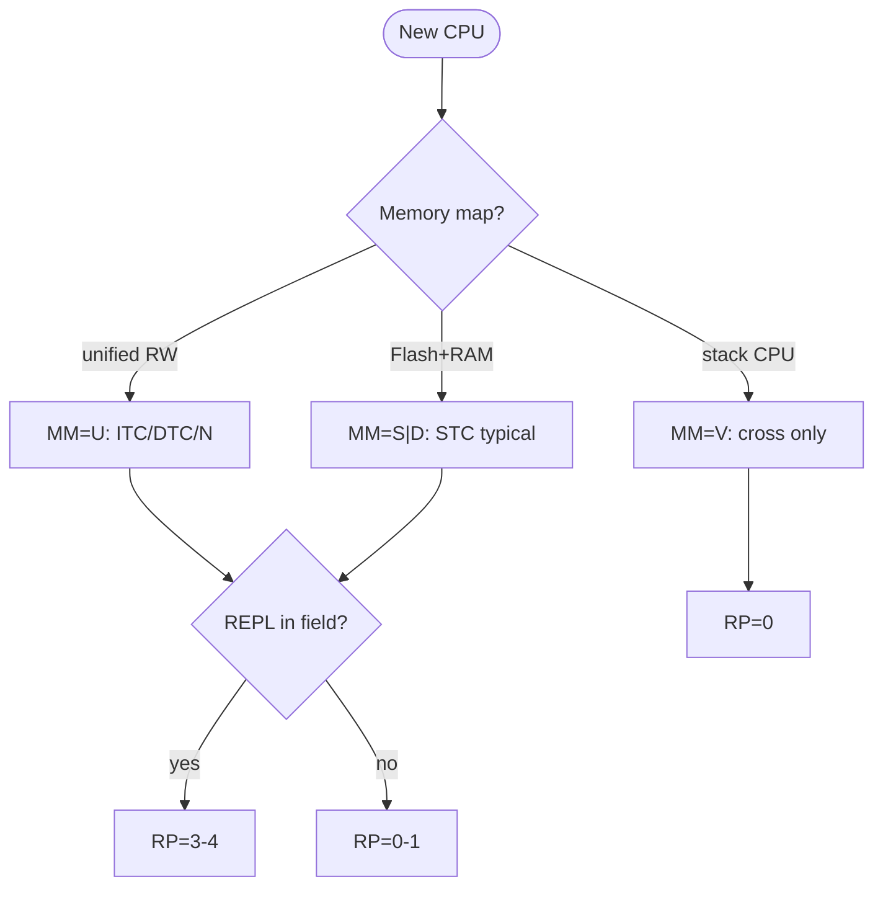

# Forth System Architecture: Hardware Adaptation Map

> **Russian:** [FORTH-SYSTEM-ARCHITECTURE.md](FORTH-SYSTEM-ARCHITECTURE.md)  
> **Authorship / disclaimers:** [DOC-AUTHORSHIP-eng.md](DOC-AUTHORSHIP-eng.md) — AI-assisted; human-directed; no guarantee of full human proofread.

Reference for **people** (porting, choosing a system, understanding embedded Forth) and for **dataset authors / trainable models** (stable codes, profiles, distinguishing “VM” vs STC vs cross-only).

**Related documents:**

| Document | Content |
|----------|---------|
| [`FORTH-HARDWARE-CODESIGN-eng.md`](FORTH-HARDWARE-CODESIGN-eng.md) | **Hardware + Forth co-design** for the task (ECU, FPGA, retro) |
| [`FORTH-FMAP-GUIDE-eng.md`](FORTH-FMAP-GUIDE-eng.md) | **Using FMAP**: choosing Forth for a task, examples, graphs |
| [`FORTH-THREADING-eng.md`](FORTH-THREADING-eng.md) | **Threaded code**: ITC, DTC, STC, native, comparison |
| [`FORTH-FEATURE-COMPLEXITY-eng.md`](FORTH-FEATURE-COMPLEXITY-eng.md) | bootstrap (~31 prim), **cost** of features (locals, FILE, …) |
| [`data/forth-fmap-profiles.json`](../data/forth-fmap-profiles.json) | machine-readable system profiles (FMAP) |
| [`data/forth-threading-models.json`](../data/forth-threading-models.json) | threading models (EX-C), link to profiles |
| [`MODEL-TRAINING.md`](MODEL-TRAINING.md) | how to include this topic in SFT |
| [`forth-portability.mdc`](../rules/forth-portability.mdc) | application code portability |
| [`FORTH-ANS-PORTABILITY-LAYER-eng.md`](FORTH-ANS-PORTABILITY-LAYER-eng.md) | **ANS as an algorithm layer** above any FMAP |
| [`FORTH-DIALECT-LAYERS-eng.md`](FORTH-DIALECT-LAYERS-eng.md) | **Layer 0**: domain dialects **FORTH-X** |
| [`FORTH-STACK-CPU-RESEARCH-eng.md`](FORTH-STACK-CPU-RESEARCH-eng.md) | **Research theses**: superscalar stack frontend (zzeng distill) |

**External sources:** [ForthHub/ForthCPUs](https://github.com/ForthHub/ForthFreak/blob/master/ForthCPUs), [forth-standard.org/systems](https://forth-standard.org/systems), [Koopman stack computers](https://users.ece.cmu.edu/~koopman/stack_computers/sections.html).

---

## Contents

1. [Terms: runtime, REPL, “virtual machine”](#1-terms-runtime-repl-virtual-machine)
2. [FMAP / FTAS classification](#2-fmap--ftas-classification)
3. [Memory: Harvard and unified](#3-memory-harvard-and-unified)
4. [Execution: three EX levels](#4-execution-three-ex-levels)
5. [Runtime profile RP](#5-runtime-profile-rp)
6. [Build and codegen](#6-build-and-codegen)
7. [Forth-assembler](#7-forth-assembler)
8. [Decision trees](#8-decision-trees)
9. [Architecture classes 0–4](#9-architecture-classes-0–4)
   - [9.1 Three independent axes (ISA · Forth model · runtime)](#91-three-independent-axes-isa--forth-model--runtime)
10. [CPU and system catalog](#10-cpu-and-system-catalog)
11. [Case study: stm8ef](#11-case-study-stm8ef)
    - [11.1 Case study: J1](#111-case-study-j1)
12. [Misconceptions](#12-misconceptions)
13. [For dataset authors and models](#13-for-dataset-authors-and-models)

---

## 1. Terms: runtime, REPL, “virtual machine”

### Forth is not necessarily “a VM like JVM”

Correct terms:

| Term | Meaning |
|--------|---------|
| **Engine / kernel** | stacks, dispatch, primitives, cold start |
| **Inner interpreter** | `NEXT` loop — only with **ITC/DTC** |
| **Text interpreter (outer)** | `INTERPRET` / `COMPILE`, parsing, `STATE` |
| **Dictionary** | names → executable bodies |
| **System image** | kernel + dictionary + data in ROM/RAM |
| **Runtime** | everything needed after reset for code to run |

Forth is an **extensible execution environment with a dictionary**. Compiler and executor are often **inside** the firmware, not outside it.

### REPL — definition

**REPL** (Read–Eval–Print Loop) in Forth is not “any serial port”; it is:

| Level | Component |
|---------|-----------|
| Console I/O | `KEY`, `EMIT`, UART/SWIM |
| Line input | `QUERY`, `ACCEPT`, TIB |
| Eval loop | **`QUIT` → `INTERPRET`** |
| Feedback | `ok`, `.`, `.s` |

**Forth without a REPL is still Forth** if the language model exists (stacks, words, dictionary). ANS **does not require** a REPL. Embedded often: dev with REPL → product with `autostart` and no console.

### “Is Forth just Forth?” (minimal criteria)

| Criterion | Required? |
|-----------|-------------|
| Postfix, stacks | yes |
| Colon definitions (at least at build time) | almost always |
| Dictionary | yes (may be read-only in ROM) |
| REPL | **no** |
| Runtime compile of new words | **no** |
| Redefinition of names | **no** |

---

## 2. FMAP / FTAS classification

**FMAP** (Forth Memory Architecture Profile) — compact profile code for a system.  
**FTAS** — full string with build/codegen (FMAP extension).

### Axes (required)

| Code | Axis | Values |
|-----|-----|----------|
| **MM** | Memory model | **U** unified · **S** split Flash+RAM · **D** dual dict (RAM+NVM) · **F** frozen · **V** Forth-ISA CPU |
| **EX-O** | Outer (text) | **I** interpret-only boot · **C** compile-only · **M** mixed (`STATE`) |
| **EX-C** | Colon body (= threading) | **I** ITC · **D** DTC · **S** STC · **N** native · **V** VM opcodes · **B** bytecode |
| **EX-P** | Primitives | **A** asm · **V** via NEXT · **S** subroutine entry · **G** generated (dynasm) |
| **RP** | Runtime capabilities | **0** execute-only … **5** full meta (`MARKER`, vocabs) |
| **CG** | Code generation | **E** external asm · **F** Forth-assembler · **I** Forth=ISA · **M** mixed |
| **BM** | Bootstrap | **T** toolchain → image · **C** Forth cross · **N** native self-rebuild · **H** hybrid |
| **OR** | Outer core source | **A** in asm/C · **F** colon after bootstrap · **M** mixed |
| **KP** | Kernel size | **M** minimal ~31 prim · **S** slim · **R** rich asm · **V** CPU-native |
| **NC** | Native compile of `:` | **0** threaded only · **1** `CODE` only · **2** peephole · **3** colon→native |

### Tags (optional, via `+`)

| Tag | Meaning |
|-----|--------|
| `+C` | link with C (`main`, ISR) |
| `+F` | compile to Flash on target |
| `+B` | modular board profiles |
| `+L` | locals |
| `+X` | cross-dictionary / vocabularies |

### Profile string format

```
FMAP/<name>: MM-EX-O/EX-C/EX-P-RP-CG
             [NC=n] [+tags]

Example:
FMAP/stm8ef: D-S-A-M-4-E  NC=0  +C+F+B
```

Full profile catalog: [`data/forth-fmap-profiles.json`](../data/forth-fmap-profiles.json).

---

## 3. Memory: Harvard and unified

### Comparison

| MM | CPU | Code | Data | Runtime dict extend |
|----|-----|------|------|---------------------|
| **U** | x86, Linux ARM | RAM (W^X varies) | same | `HERE ,` |
| **S** | AVR, PIC, MSP430 | Flash exec | RAM | RAM dict; Flash via NVM |
| **D** | **STM8** | Flash kernel + NVM dict | RAM dict + stacks | **two CP**: CTOP + NVMCP |
| **F** | product firmware | frozen Flash | RAM | none in the field |
| **V** | J1, NC4016 | insn stream | stacks on-chip/off-chip | build-time |

### Harvard: kernel vs extension

```
Flash:  kernel asm, prim, (optional) NVM dictionary
RAM:    CTOP dictionary, stacks, variables, PAD
Compile:
  → RAM:  normal , C,
  → Flash: NVM programmer (NOT an alias for !)
Execute:
  → native CALL/CALLR (STC), not fetch bytecode
```

**Self-modifying code** in the classical sense (`!` into the instruction stream) on Harvard MCUs **does not exist** — there is **dictionary growth** and **NVM programming**.

---

## 4. Execution: three EX levels

```
Source text
      ↓
  EX-O  ($INTERPRET, STATE)
      ↓
  EX-C  (body of : foo — ITC / DTC / STC / native / V)
      ↓
  EX-P  (primitives — asm, NEXT, DOXCODE)
```

### Threading models (EX-C)

Detailed ITC, DTC, STC, native, bytecode and system table — **[`FORTH-THREADING-eng.md`](FORTH-THREADING-eng.md)** and [`data/forth-threading-models.json`](../data/forth-threading-models.json).

| EX-C | Brief | Inner loop? |
|------|--------|-------------|
| **I** ITC | list of xt (indirect threaded code) | yes, `NEXT` |
| **D** DTC | list of code addr (direct threaded code) | yes |
| **S** STC | chain of `CALL` (subroutine) | **no** |
| **N** | machine code | no |
| **V** | CPU insn (J1) | CPU = loop |
| **B** | bytecode VM | own dispatch |

**stm8ef — EX-C/S**, not a bytecode VM. A colon word = **native calls**, not interpretation of opcodes from RAM/Flash.

---

## 5. Runtime profile RP

| RP | REPL | Compile `: ;` | Change dict | Redefinition | Example |
|----|------|---------------|-------------|----------------|--------|
| **0** | no | no | no | no | J1 firmware |
| **1** | opt. | build-time only | none in field | no | autostart product |
| **2** | yes | no | no | no | read-only teaching |
| **3** | yes | → RAM | yes | yes | RAM-target dev |
| **4** | yes | → Flash | yes (NVM) | yes | **stm8ef** dev |
| **5** | yes | yes | + FORGET/vocabs | yes | Gforth |

**Shrinking runtime:** deliberately lower RP (do not link `$COMPILE`, NVM writer, …) — Forth on the host was the **build tool**, not the field OS.

---

## 6. Build and codegen

| CG | Who emits machine code | Examples |
|----|------------------------|---------|
| **E** | SDCC, gas, ASM80 | stm8ef, Firth |
| **F** | Forth-assembler on host | Cerberus `asmz80.4th` |
| **I** | Forth = opcode bits | J1 `basewords.fs` |
| **M** | mixed | Gforth engine + Forth core |

| BM | Meaning |
|----|--------|
| **T** | `make` / SDCC → flash, app on target |
| **C** | host Forth cross → target image |
| **H** | cross kernel + native extend |
| **N** | target rebuilds itself |

---

## 7. Forth-assembler

| Level | Role |
|---------|------|
| **Engine primitives** | asm/C in image |
| **CODE / DOXCODE** | inline asm in kernel or user |
| **Forth-assembler** | CPU mnemonics as words (`mov,`, `A;`) |
| **Forth = ISA** | `{ T+N alu }` without CPU mnemonics |

| System | Assembler |
|---------|-----------|
| Gforth desktop | per-CPU `code` / `abi-code` |
| Cerberus Z80 | `asmz80.4th`, DEFER for cross/self |
| J1 | opcode fields in Forth |
| stm8ef | **no** user Forth-assembler; `DOXCODE` only in `forth.asm` |
| Firth | external ASM80 |

---

## 8. Decision trees

Step-by-step Forth choice by **domain** (embedded, ECU, smartphone, FPGA) — **[`FORTH-FMAP-GUIDE-eng.md`](FORTH-FMAP-GUIDE-eng.md)** and [`forth-use-case-templates.json`](../data/forth-use-case-templates.json).

### 8.1 Where to start a port



### 8.2 MM → techniques

| MM | Kernel | Colon | Dict | Compile path |
|----|--------|-------|------|--------------|
| U | image | `HERE ,` | one heap | = data |
| S | Flash asm | STC | RAM (+Flash opt) | NVM |
| D | Flash asm | STC | RAM + **NVMCP** | dual paths |
| F | prebuilt | prebuilt | frozen | host |
| V | opcodes | insn list | build-time | host cross |

---

## 9. Architecture classes 0–4

| Class | Hardware | MM | Typical EX-C | RP |
|-------|----------|-----|--------------|-----|
| **0** | Forth-native silicon / soft-CPU | V | V | 0–2 |
| **1** | Harvard 8/16-bit MCU | S, D | S | 3–4 |
| **2** | Retro 64K (6502, Z80) | U, S | S, I | 3–4 |
| **3** | 32-bit MCU (ARM, RV) | S | N | 4 |
| **4** | Desktop / OS | U | I→N | 5 |

Co-design of a new platform for the task (ECU, FPGA, custom peripherals) — **[`FORTH-HARDWARE-CODESIGN-eng.md`](FORTH-HARDWARE-CODESIGN-eng.md)**.

### 9.1 Three independent axes (ISA · Forth model · runtime)

Do not conflate three levels — they are **loosely coupled**:

| Axis | Question | Examples |
|------|----------|----------|
| **ISA** | How does the CPU operate on operands? | J1: postfix, T+N; ARM: registers |
| **Forth model** | How does the language describe parameters? | `( … -- … )`, PSP/RSP as abstraction |
| **Runtime (EX-C)** | How is `: word` executed? | ITC+`NEXT`, STC, **V** = insn stream |

**Consequences (important for models and porting):**

- **Register CPU + Forth** — the norm (STM8, AVR, ARM): stacks **in RAM**, PSP/RSP are pointers.
- **Stack CPU + non-Forth** — possible: postfix ISA, any frontend (asm, domain DSL).
- **J1** — not “full Forth runtime in silicon”, but **ISA=V + cross-expand**: colon words
  are expanded on the host into insn; inner interpreter **absent** (RP=0).

See also [`FORTH-THREADING-eng.md`](FORTH-THREADING-eng.md) (EX-C=V) and J1 case study — §11.1.

---

## 10. CPU and system catalog

A complete list of all CPUs is **impossible** ([ForthCPUs](https://github.com/ForthHub/ForthFreak/blob/master/ForthCPUs)). Below — **typical families** and profiles.

### Class 0 — Forth-native / stack CPU

| Architecture | Status | FMAP (brief) | Systems |
|-------------|--------|---------------|---------|
| Novix NC4016/5016 | ◐ legacy | V/V/A/2 | direct Forth ISA |
| Harris RTX 2000/2010 | ◐ space | V/V/A/2–3 | [RTX](https://en.wikipedia.org/wiki/Harris_RTX_2000) |
| MuP21 / F21 | ○ | V/V/A/1–2 | Moore stack CPUs |
| GreenArrays GA144/F18 | ● niche | V/V/1–4/M | [GreenArrays](https://www.greenarraychips.com/) |
| J1 / J1a | ● | V/V/0/I | [jamesbowman/j1](https://github.com/jamesbowman/j1) |
| Mecrisp-Ice | ● | V/V/0–1/I | [Mecrisp](https://mecrisp.sourceforge.net/) |
| Steamer16, CD16, Sh-Boom, … | ○ | V/?/? | [ForthCPUs list](https://github.com/ForthHub/ForthFreak/blob/master/ForthCPUs) |

#### Stack CPU: two stack implementation types

| Type | Where stacks live | Depth | Overflow |
|------|-------------------|-------|----------|
| **Fixed internal** | on-chip register file / shallow RAM | fixed (~32…) | **no spill** — silent corruption |
| **RAM-backed** | PSP/RSP → memory; TOS often in register | ≈ RAM size | guard / `-3 throw` (if implemented) |

**J1** — **fixed internal** (~33 data + ~32 return). It is **not the reference** for all Forth CPUs:
typical embedded Forth on MCUs and many historical stack machines are **RAM-backed**.
Forks (forthytwo, H2) move back to RAM+pointers when the internal stack is insufficient.

**Metaphor (not an FMAP axis):** J1’s fixed internal stacks resemble a **narrow execution core**
(hot path call/ret, T+N ALU); RAM holds **state and code** — not a full Gforth parameter stack.

### Class 1 — Harvard MCU

| CPU | FMAP | Systems | Notes |
|-----|------|---------|---------|
| **STM8** | D/S/4/E | [stm8ef](https://github.com/TG9541/stm8ef) ● | dual dict, STC, +Flash |
| **AVR** | S/4/E | AmForth, [FlashForth](https://flashforth.com/) ● | soft-mapped `@`/`!` |
| **PIC18/24/33** | S/4/E | FlashForth ● | compile always Flash |
| **MSP430** | S/3–4/M | [Mecrisp](https://mecrisp.sourceforge.net/) ● | compile Flash without erase |
| **8051** | S/4/E | [8051-eForth](https://github.com/TG9541/8051-eForth) ◐ | STC eForth v2 |
| 6805, 68HC11/12, 8096, … | S/?/E | eForth ports ○ | [forth.org/library](https://www.forth.org/library/index.htm) |

### Class 2 — Retro

| CPU | FMAP | Systems |
|-----|------|---------|
| **6502/65c02** | U/S/3–4 | [TaliForth2](https://github.com/SamCoVT/TaliForth2) STC ● |
| **Z80** | S/3–4 | [Cerberus](https://github.com/lennart-benschop/cerberus-z80-forth), [Firth](https://github.com/jhlagado/firth) |
| 8080, 6809, 68000 | U/… | FIG-Forth, F83 ○ |

### Class 3 — 32-bit MCU

| CPU | FMAP | Systems |
|-----|------|---------|
| **ARM Cortex-M** | S/N/4/M | Mecrisp-Stellaris ● |
| **RISC-V RV32** | S/4/M | Mecrisp-Quintus, noForth ● |
| **RP2040** | S/4/E | noForth |
| **MIPS M4K** | S/4/M | Mecrisp-Quintus |

### Class 4 — Desktop

| CPU | FMAP | Systems |
|-----|------|---------|
| **x86/x64** | U/5/N/M | Gforth, SwiftForth, VFX ● |
| **ARM64 Linux** | U/5/N | Gforth, VFX |

**Status:** ● active · ◐ legacy/niche · ○ defunct/archive

---

## 11. Case study: stm8ef

See also §11.1 (J1, class 0).

Repository: [TG9541/stm8ef](https://github.com/TG9541/stm8ef)

```
FMAP/stm8ef: D-S-A-M-4-E  EX-O=M  EX-C=S  EX-P=A  NC=0  +C+F+B
Class: 1 (Harvard 8-bit MCU)
```

| Question | Answer |
|--------|--------|
| Harvard? | yes: Flash exec, RAM data |
| Bytecode VM? | **no** — STC, native `CALL` |
| Dual dictionary? | **yes**: CTOP (RAM), NVMCP (Flash) |
| REPL? | yes (UART/SWIM); product may autostart |
| Kernel | rich asm (`forth.asm`), OR-A, KP-R |
| Self-modify code? | no; NVM compile ≠ `!` in code |
| eForth lineage? | STC, Ting V2; not minimal 31-prim bootstrap |

Memory (STM8S103F3): RAM `0x0000`…, EEPROM `0x4000`…, Flash `0x8000`… — see `target.inc` in the repository.

### 11.1 Case study: J1

Repository: [jamesbowman/j1](https://github.com/jamesbowman/j1)

```
FMAP/j1: V-V-A-0-I  EX-O=C  EX-C=V  EX-P=A  NC=0
Class: 0 (Forth-native soft-CPU)
Stacks: fixed internal (~33 data, ~32 return)
```

| Question | Answer |
|----------|--------|
| Stack CPU? | **yes** — postfix, T (`st0`) + N (`st1`), ALU in 1 cycle |
| Return stack in silicon? | **yes** (~32), mainly call/ret; not full Gforth `>R` runtime out of the box |
| Forth word = 1 opcode? | **no** — host cross **expands** `: word` into insn stream |
| Inner interpreter? | **no** — CPU fetch/decode is execution |
| REPL / `DEPTH` in field? | **no** (RP=0); depth control — **design + simulation** |
| Stack overflow? | **no** `-3 throw`; overflow → corruption (fixed internal) |
| Byte `@`/`!`? | aligned 16-bit only; bytes — **software** |
| Port Gforth algo “as is”? | **no** — shallow stack, RAM for state, see contract below |

#### Programming contract (J1-class, fixed internal stack)

1. **Stack** — wires between words (0–3 levels typical); **state** → `VARIABLE` / buffers in RAM.
2. **Worst-case depth** (data **and** return: `DO`, call chain, `>R`) — compute **before** ship; do not rely on `DEPTH`.
3. If depth is insufficient → factoring, software stack extension (forks), or **another target** (MCU + STC).
4. Do not confuse with **RAM-backed** stack CPU where depth scales with memory.

Co-design entry: [`FORTH-HARDWARE-CODESIGN-eng.md`](FORTH-HARDWARE-CODESIGN-eng.md) §4 L2.

---

## 12. Misconceptions

| Claim | True? |
|-------------|--------|
| Forth = REPL | **no** |
| Forth on MCU = bytecode VM | **often no** (STC) |
| stm8ef interprets opcodes from RAM/Flash | **no** |
| Dual dict = VM picks bytecode source | **no** — two dictionary heaps, exec = CALL |
| Any `.fs` → bare asm without runtime | **no** — needs AOT/cross and RP↓ |
| Cross + fixed app → minimal runtime | **partly yes** |
| Redefined a word — new everywhere | **no** — old xt in already compiled `: … ;` |
| Stack CPU ⇒ full Forth runtime in silicon | **no** — depends on EX-C and stack depth |
| J1 = reference for any Forth CPU | **no** — fixed internal, minimal control core |
| J1 has no return stack | **no** — yes (~32), but narrow; not Gforth semantics |
| Forth word on J1 = one opcode | **no** — colon expand on host |
| Any stack CPU auto-spills stack to RAM | **no** — only RAM-backed PSP/RSP |
| Register CPU “worse” for Forth | **no** — STC + stacks in RAM dominates |

### Spectrum “Forth → firmware”

```
RP-5 full REPL (dev)
  → RP-4 Flash compile (stm8ef field dev)
    → RP-1 autostart product
      → RP-0 cross blob (J1, AOT)
```

---

## 13. For dataset authors and models

### What to include in SFT context

For “prompt → Forth for embedded” pairs, when possible specify:

1. **Target CPU / system** (e.g. `stm8ef`, `Gforth`, `Mecrisp-Stellaris`).
2. **FMAP code** or explicitly: MM, EX-C, RP.
3. **Environmental dependencies** — see [`forth-portability.mdc`](../rules/forth-portability.mdc).
4. **Do not confuse** Gforth `{ }` with ANS embedded without locals.

### Machine-readable profiles

File [`data/forth-fmap-profiles.json`](../data/forth-fmap-profiles.json) + [`data/forth-threading-models.json`](../data/forth-threading-models.json) (join `ex_c` ↔ `fmap_ex_c`):

- fields `id`, `name`, `mm`, `ex_c`, `rp`, `cg`, `class`, `status`, `url`, `notes`
- for filtering / conditioning during training

### Prompt template (system context)

```text
Target: stm8ef on STM8 (Harvard).
FMAP: MM=D EX-C=S RP=4 — STC, not bytecode VM; dual RAM+Flash dictionary.
Dialect: eForth STC subset; no Gforth { locals } unless shim documented.
```

### Link to frules rules

| Model task | Rule / doc |
|--------------|------------|
| Gforth desktop challenges | `forth-dialect-gforth.mdc` |
| ANS portability | `forth-portability.mdc` |
| Embedded port design | **this document** + FMAP JSON |
| ITC vs DTC vs STC, inner loop | [`FORTH-THREADING-eng.md`](FORTH-THREADING-eng.md) + threading JSON |
| Cost of adding locals/FILE | `FORTH-FEATURE-COMPLEXITY-eng.md` |

### What the model should not do

- Call stm8ef a “Forth bytecode VM”.
- Suggest `{ locals }` for stm8ef without an explicit shim.
- Assume unified `HERE ,` on Harvard Flash compile.
- Confuse text `INTERPRET` with inner `NEXT`.
- Port Gforth algorithms to J1 without shallow stack and RAM state (see §11.1).
- Treat J1 as “full Forth” with `-3 throw` and unlimited stack.

---

## References

- [Gforth: elements of a Forth system](../sources/gforth-manual/review--002d-elements-of-a-forth-system.md)
- [Gforth: assembler and code words](../sources/gforth-manual/assembler-and-code-words.md)
- [eForth index (forth.org)](https://www.forth.org/library/index.htm)
- [FlashForth memory mapping](https://flashforth.com/)
- [Mecrisp family](https://mecrisp.sourceforge.net/)

---

*Hand-authored for frules.*
