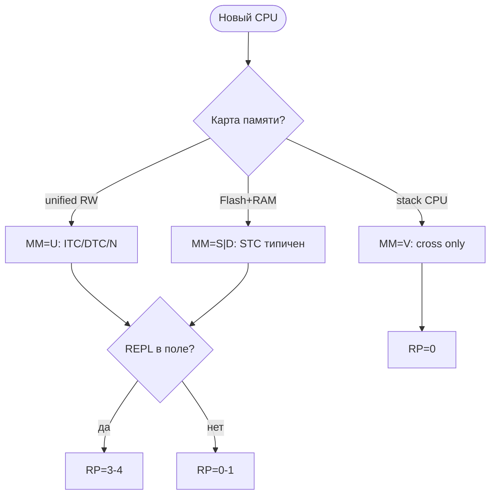

# Архитектура Forth-систем: карта адаптации к железу

> **English:** [FORTH-SYSTEM-ARCHITECTURE-eng.md](FORTH-SYSTEM-ARCHITECTURE-eng.md)  
> **Авторство и оговорки:** [DOC-AUTHORSHIP.md](DOC-AUTHORSHIP.md) — AI-assisted; human-directed; без гарантии полной вычитки.

Справочник для **людей** (портирование, выбор системы, понимание embedded Forth) и для **авторов датасета / обучаемых моделей** (стабильные коды, профили, различение «VM» vs STC vs cross-only).

**Связанные документы:**

| Документ | Содержание |
|----------|------------|
| [`FORTH-HARDWARE-CODESIGN.md`](FORTH-HARDWARE-CODESIGN.md) | **Co-design железа + Forth** под задачу (ECU, FPGA, retro) |
| [`FORTH-FMAP-GUIDE.md`](FORTH-FMAP-GUIDE.md) | **Как пользоваться FMAP**: выбор Forth под задачу, примеры, графы |
| [`FORTH-THREADING.md`](FORTH-THREADING.md) | **Шитый код**: ITC, DTC, STC, native, сравнение |
| [`FORTH-FEATURE-COMPLEXITY.md`](FORTH-FEATURE-COMPLEXITY.md) | bootstrap (~31 prim), **стоимость** фич (locals, FILE, …) |
| [`data/forth-fmap-profiles.json`](../data/forth-fmap-profiles.json) | машиночитаемые профили систем (FMAP) |
| [`data/forth-threading-models.json`](../data/forth-threading-models.json) | модели threading (EX-C), связь с профилями |
| [`MODEL-TRAINING.md`](MODEL-TRAINING.md) | как включать эту тему в SFT |
| [`forth-portability.mdc`](../rules/forth-portability.mdc) | переносимость прикладного кода |
| [`FORTH-ANS-PORTABILITY-LAYER.md`](FORTH-ANS-PORTABILITY-LAYER.md) | **ANS как слой алгоритмов** поверх любого FMAP |
| [`FORTH-DIALECT-LAYERS.md`](FORTH-DIALECT-LAYERS.md) | **Слой 0**: доменные диалекты **FORTH-X** |
| [`FORTH-STACK-CPU-RESEARCH.md`](FORTH-STACK-CPU-RESEARCH.md) | **Исследовательские тезисы**: суперскалярный стековый фронтенд, Эльбрус, loop fracking |

**Источники (внешние):** [ForthHub/ForthCPUs](https://github.com/ForthHub/ForthFreak/blob/master/ForthCPUs), [forth-standard.org/systems](https://forth-standard.org/systems), [Koopman stack computers](https://users.ece.cmu.edu/~koopman/stack_computers/sections.html).

---

## Содержание

1. [Термины: runtime, REPL, «виртуалка»](#1-термины-runtime-repl-виртуалка)
2. [Классификация FMAP / FTAS](#2-классификация-fmap--ftas)
3. [Память: Harvard и unified](#3-память-harvard-и-unified)
4. [Исполнение: три уровня EX](#4-исполнение-три-уровня-ex)
5. [Runtime profile RP](#5-runtime-profile-rp)
6. [Сборка и codegen](#6-сборка-и-codegen)
7. [Forth-assembler](#7-forth-assembler)
8. [Деревья решений](#8-деревья-решений)
9. [Классы архитектур 0–4](#9-классы-архитектур-0–4)
   - [9.1 Три независимые оси (ISA · модель Forth · runtime)](#91-три-независимые-оси-isa--модель-forth--runtime)
10. [Каталог CPU и систем](#10-каталог-cpu-и-систем)
11. [Разбор: stm8ef](#11-разбор-stm8ef)
    - [11.1 Разбор: J1](#111-разбор-j1)
12. [Заблуждения](#12-заблуждения)
13. [Для авторов датасета и модели](#13-для-авторов-датасета-и-модели)

---

## 1. Термины: runtime, REPL, «виртуалка»

### Forth — не обязательно «VM как JVM»

Корректные термины:

| Термин | Что обозначает |
|--------|----------------|
| **Engine / kernel** | стеки, dispatch, примитивы, cold start |
| **Inner interpreter** | цикл `NEXT` — только у **ITC/DTC** |
| **Text interpreter (outer)** | `INTERPRET` / `COMPILE`, парсинг, `STATE` |
| **Dictionary** | имена → исполняемые тела |
| **System image** | kernel + словарь + данные в ROM/RAM |
| **Runtime** | всё, что нужно после reset для работы кода |

Forth — **расширяемая среда исполнения со словарём**. Компилятор и исполнитель часто **внутри** прошивки, не снаружи.

### REPL — определение

**REPL** (Read–Eval–Print Loop) в Forth — не «любой serial», а:

| Уровень | Компонент |
|---------|-----------|
| Console I/O | `KEY`, `EMIT`, UART/SWIM |
| Line input | `QUERY`, `ACCEPT`, TIB |
| Eval loop | **`QUIT` → `INTERPRET`** |
| Feedback | `ok`, `.`, `.s` |

**Forth без REPL — всё ещё Forth**, если есть модель языка (стеки, слова, словарь). ANS **не требует** REPL. Embedded часто: dev с REPL → product с `autostart` без консоли.

### «Forth — это Forth?» (минимальные критерии)

| Критерий | Обязателен? |
|----------|-------------|
| Postfix, стеки | да |
| Colon definitions (хотя бы при сборке) | почти всегда |
| Dictionary | да (может быть read-only в ROM) |
| REPL | **нет** |
| Runtime compile новых слов | **нет** |
| Переопределение имён | **нет** |

---

## 2. Классификация FMAP / FTAS

**FMAP** (Forth Memory Architecture Profile) — компактный код профиля системы.  
**FTAS** — полная строка с build/codegen (расширение FMAP).

### Оси (обязательные)

| Код | Ось | Значения |
|-----|-----|----------|
| **MM** | Memory model | **U** unified · **S** split Flash+RAM · **D** dual dict (RAM+NVM) · **F** frozen · **V** Forth-ISA CPU |
| **EX-O** | Outer (текст) | **I** interpret-only boot · **C** compile-only · **M** mixed (`STATE`) |
| **EX-C** | Colon body (= threading) | **I** ITC · **D** DTC · **S** STC · **N** native · **V** VM opcodes · **B** bytecode |
| **EX-P** | Primitives | **A** asm · **V** via NEXT · **S** subroutine entry · **G** generated (dynasm) |
| **RP** | Runtime capabilities | **0** execute-only … **5** full meta (`MARKER`, vocabs) |
| **CG** | Code generation | **E** external asm · **F** Forth-assembler · **I** Forth=ISA · **M** mixed |
| **BM** | Bootstrap | **T** toolchain → image · **C** Forth cross · **N** native self-rebuild · **H** hybrid |
| **OR** | Outer core source | **A** in asm/C · **F** colon after bootstrap · **M** mixed |
| **KP** | Kernel size | **M** minimal ~31 prim · **S** slim · **R** rich asm · **V** CPU-native |
| **NC** | Native compile of `:` | **0** threaded only · **1** `CODE` only · **2** peephole · **3** colon→native |

### Теги (опционально, через `+`)

| Тег | Смысл |
|-----|--------|
| `+C` | link с C (`main`, ISR) |
| `+F` | compile в Flash на target |
| `+B` | модульные board profiles |
| `+L` | locals |
| `+X` | cross-dictionary / vocabularies |

### Формат строки профиля

```
FMAP/<name>: MM-EX-O/EX-C/EX-P-RP-CG
             [NC=n] [+tags]

Пример:
FMAP/stm8ef: D-S-A-M-4-E  NC=0  +C+F+B
```

Полный каталог профилей: [`data/forth-fmap-profiles.json`](../data/forth-fmap-profiles.json).

---

## 3. Память: Harvard и unified

### Сравнение

| MM | CPU | Code | Data | Runtime dict extend |
|----|-----|------|------|---------------------|
| **U** | x86, Linux ARM | RAM (W^X varies) | same | `HERE ,` |
| **S** | AVR, PIC, MSP430 | Flash exec | RAM | RAM dict; Flash via NVM |
| **D** | **STM8** | Flash kernel + NVM dict | RAM dict + stacks | **два CP**: CTOP + NVMCP |
| **F** | product firmware | frozen Flash | RAM | нет в поле |
| **V** | J1, NC4016 | insn stream | stacks on-chip/off-chip | build-time |

### Harvard: kernel vs extension

```
Flash:  kernel asm, prim, (optional) NVM dictionary
RAM:    CTOP dictionary, stacks, variables, PAD
Compile:
  → RAM:  обычные , C,
  → Flash: NVM programmer (НЕ alias для !)
Execute:
  → нативный CALL/CALLR (STC), не fetch bytecode
```

**Self-modify code** в классическом смысле (`!` в instruction stream) на Harvard MCU **нет** — есть **рост словаря** и **NVM programming**.

---

## 4. Исполнение: три уровня EX

```
Исходный текст
      ↓
  EX-O  ($INTERPRET, STATE)
      ↓
  EX-C  (тело : foo — ITC / DTC / STC / native / V)
      ↓
  EX-P  (примитивы — asm, NEXT, DOXCODE)
```

### Threading models (EX-C)

Подробный разбор ITC, DTC, STC, native, bytecode и таблица систем — **[`FORTH-THREADING.md`](FORTH-THREADING.md)** и [`data/forth-threading-models.json`](../data/forth-threading-models.json).

| EX-C | Кратко | Inner loop? |
|------|--------|-------------|
| **I** ITC | список xt (косвенный шитый код) | да, `NEXT` |
| **D** DTC | список code addr (прямой шитый код) | да |
| **S** STC | цепочка `CALL` (подпрограммный) | **нет** |
| **N** | машинный код | нет |
| **V** | CPU insn (J1) | CPU = loop |
| **B** | bytecode VM | свой dispatch |

**stm8ef — EX-C/S**, не bytecode VM. Colon word = **нативные вызовы**, не интерпретация opcodes из RAM/Flash.

---

## 5. Runtime profile RP

| RP | REPL | Compile `: ;` | Менять dict | Переопределение | Пример |
|----|------|---------------|-------------|-----------------|--------|
| **0** | нет | нет | нет | нет | J1 firmware |
| **1** | опц. | только при сборке | нет в поле | нет | autostart product |
| **2** | да | нет | нет | нет | read-only teaching |
| **3** | да | → RAM | да | да | RAM-target dev |
| **4** | да | → Flash | да (NVM) | да | **stm8ef** dev |
| **5** | да | да | + FORGET/vocabs | да | Gforth |

**Уменьшение runtime:** сознательно понизить RP (не линковать `$COMPILE`, NVM writer, …) — Forth на host был **инструментом сборки**, не OS в поле.

---

## 6. Сборка и codegen

| CG | Кто emits machine code | Примеры |
|----|------------------------|---------|
| **E** | SDCC, gas, ASM80 | stm8ef, Firth |
| **F** | Forth-assembler на host | Cerberus `asmz80.4th` |
| **I** | Forth = биты opcode | J1 `basewords.fs` |
| **M** | смешанное | Gforth engine + Forth core |

| BM | Смысл |
|----|--------|
| **T** | `make` / SDCC → flash, app на target |
| **C** | host Forth cross → target image |
| **H** | cross kernel + native extend |
| **N** | target пересобирает себя |

---

## 7. Forth-assembler

| Уровень | Роль |
|---------|------|
| **Примитивы движка** | asm/C в образе |
| **CODE / DOXCODE** | inline asm в kernel или user |
| **Forth-assembler** | мнемоники CPU как слова (`mov,`, `A;`) |
| **Forth = ISA** | `{ T+N alu }` без CPU mnemonics |

| Система | Assembler |
|---------|-----------|
| Gforth desktop | per-CPU `code` / `abi-code` |
| Cerberus Z80 | `asmz80.4th`, DEFER для cross/self |
| J1 | opcode fields в Forth |
| stm8ef | **нет** user Forth-assembler; `DOXCODE` только в `forth.asm` |
| Firth | внешний ASM80 |

---

## 8. Деревья решений

Пошаговый выбор Forth под **предметную область** (embedded, ECU, смартфон, FPGA) — **[`FORTH-FMAP-GUIDE.md`](FORTH-FMAP-GUIDE.md)** и [`forth-use-case-templates.json`](../data/forth-use-case-templates.json).

### 8.1 С чего начать порт



### 8.2 MM → техники

| MM | Kernel | Colon | Dict | Compile path |
|----|--------|-------|------|--------------|
| U | image | `HERE ,` | один heap | = data |
| S | Flash asm | STC | RAM (+Flash opt) | NVM |
| D | Flash asm | STC | RAM + **NVMCP** | dual paths |
| F | prebuilt | prebuilt | frozen | host |
| V | opcodes | insn list | build-time | host cross |

---

## 9. Классы архитектур 0–4

| Класс | Железо | MM | Типичный EX-C | RP |
|-------|--------|-----|---------------|-----|
| **0** | Forth-native silicon / soft-CPU | V | V | 0–2 |
| **1** | Harvard 8/16-bit MCU | S, D | S | 3–4 |
| **2** | Retro 64K (6502, Z80) | U, S | S, I | 3–4 |
| **3** | 32-bit MCU (ARM, RV) | S | N | 4 |
| **4** | Desktop / OS | U | I→N | 5 |

Co-design новой платформы под задачу (ECU, FPGA, custom peripherals) — **[`FORTH-HARDWARE-CODESIGN.md`](FORTH-HARDWARE-CODESIGN.md)**.

### 9.1 Три независимые оси (ISA · модель Forth · runtime)

Не путать три уровня — они **слабо связаны**:

| Ось | Вопрос | Примеры |
|-----|--------|---------|
| **ISA** | Как CPU оперирует операндами? | J1: postfix, T+N; ARM: регистры |
| **Модель Forth** | Как язык описывает параметры? | `( … -- … )`, PSP/RSP как абстракция |
| **Runtime (EX-C)** | Как исполняется `: word`? | ITC+`NEXT`, STC, **V** = поток insn |

**Следствия (важно для модели и портирования):**

- **Register CPU + Forth** — норма (STM8, AVR, ARM): стеки **в RAM**, PSP/RSP — указатели.
- **Stack CPU + не-Forth** — возможно: ISA — postfix, frontend — любой (asm, domain DSL).
- **J1** — не «полный Forth-runtime в silicon», а **ISA=V + cross-expand**: colon-слова
  разворачиваются на host в insn; inner interpreter **отсутствует** (RP=0).
- **Исследовательская линия** (суперскаляр + стековый decode, Эльбрус, bookmarks) —
  **не J1**; см. [`FORTH-STACK-CPU-RESEARCH.md`](FORTH-STACK-CPU-RESEARCH.md).

См. также [`FORTH-THREADING.md`](FORTH-THREADING.md) (EX-C=V) и разбор J1 — §11.1.

---

## 10. Каталог CPU и систем

Полный список всех CPU **невозможен** ([ForthCPUs](https://github.com/ForthHub/ForthFreak/blob/master/ForthCPUs)). Ниже — **типовые семейства** и профили.

### Класс 0 — Forth-native / stack CPU

| Архитектура | Статус | FMAP (кратко) | Системы |
|-------------|--------|---------------|---------|
| Novix NC4016/5016 | ◐ legacy | V/V/A/2 | direct Forth ISA |
| Harris RTX 2000/2010 | ◐ space | V/V/A/2–3 | [RTX](https://en.wikipedia.org/wiki/Harris_RTX_2000) |
| MuP21 / F21 | ○ | V/V/A/1–2 | Moore stack CPUs |
| GreenArrays GA144/F18 | ● niche | V/V/1–4/M | [GreenArrays](https://www.greenarraychips.com/) |
| J1 / J1a | ● | V/V/0/I | [jamesbowman/j1](https://github.com/jamesbowman/j1) |
| Mecrisp-Ice | ● | V/V/0–1/I | [Mecrisp](https://mecrisp.sourceforge.net/) |
| Steamer16, CD16, Sh-Boom, … | ○ | V/?/? | [ForthCPUs list](https://github.com/ForthHub/ForthFreak/blob/master/ForthCPUs) |
| Эльбрус-1/2 (СтОп, OoO) | ◐ historical | V/?/… | [обзор zzeng](https://habr.com/ru/articles/313376/); тезисы — [`FORTH-STACK-CPU-RESEARCH.md`](FORTH-STACK-CPU-RESEARCH.md) |

#### Stack CPU: два типа реализации стеков

| Тип | Где лежит стек | Глубина | Overflow |
|-----|----------------|---------|----------|
| **Fixed internal** | on-chip register file / shallow RAM | фикс. (~32…) | **нет spill** — silent corruption |
| **RAM-backed** | PSP/RSP → память; TOS часто в регистре | ≈ размер RAM | guard / `-3 throw` (если реализовано) |

**J1** — **fixed internal** (~33 data + ~32 return). Это **не эталон** всех Forth-CPU:
типичный embedded Forth на MCU и многие historical stack machines — **RAM-backed**.
Форки (forthytwo, H2) снова идут к RAM+указатель, когда internal stack не хватает.

**Метафора (не FMAP-ось):** fixed internal stack на J1 ближе к **узкому исполнительному
ядру** (hot path call/ret, T+N ALU), а RAM — для **состояния и кода**; не замена
полноценного parameter stack Gforth.

### Класс 1 — Harvard MCU

| CPU | FMAP | Системы | Заметки |
|-----|------|---------|---------|
| **STM8** | D/S/4/E | [stm8ef](https://github.com/TG9541/stm8ef) ● | dual dict, STC, +Flash |
| **AVR** | S/4/E | AmForth, [FlashForth](https://flashforth.com/) ● | soft-mapped `@`/`!` |
| **PIC18/24/33** | S/4/E | FlashForth ● | compile always Flash |
| **MSP430** | S/3–4/M | [Mecrisp](https://mecrisp.sourceforge.net/) ● | compile Flash без erase |
| **8051** | S/4/E | [8051-eForth](https://github.com/TG9541/8051-eForth) ◐ | STC eForth v2 |
| 6805, 68HC11/12, 8096, … | S/?/E | eForth ports ○ | [forth.org/library](https://www.forth.org/library/index.htm) |

### Класс 2 — Retro

| CPU | FMAP | Системы |
|-----|------|---------|
| **6502/65c02** | U/S/3–4 | [TaliForth2](https://github.com/SamCoVT/TaliForth2) STC ● |
| **Z80** | S/3–4 | [Cerberus](https://github.com/lennart-benschop/cerberus-z80-forth), [Firth](https://github.com/jhlagado/firth) |
| 8080, 6809, 68000 | U/… | FIG-Forth, F83 ○ |

### Класс 3 — 32-bit MCU

| CPU | FMAP | Системы |
|-----|------|---------|
| **ARM Cortex-M** | S/N/4/M | Mecrisp-Stellaris ● |
| **RISC-V RV32** | S/4/M | Mecrisp-Quintus, noForth ● |
| **RP2040** | S/4/E | noForth |
| **MIPS M4K** | S/4/M | Mecrisp-Quintus |

### Класс 4 — Desktop

| CPU | FMAP | Системы |
|-----|------|---------|
| **x86/x64** | U/5/N/M | Gforth, SwiftForth, VFX ● |
| **ARM64 Linux** | U/5/N | Gforth, VFX |

**Статус:** ● active · ◐ legacy/niche · ○ defunct/archive

---

## 11. Разбор: stm8ef

См. также §11.1 (J1, класс 0).

Репозиторий: [TG9541/stm8ef](https://github.com/TG9541/stm8ef)

```
FMAP/stm8ef: D-S-A-M-4-E  EX-O=M  EX-C=S  EX-P=A  NC=0  +C+F+B
Класс: 1 (Harvard 8-bit MCU)
```

| Вопрос | Ответ |
|--------|--------|
| Harvard? | да: Flash exec, RAM data |
| Bytecode VM? | **нет** — STC, native `CALL` |
| Dual dictionary? | **да**: CTOP (RAM), NVMCP (Flash) |
| REPL? | да (UART/SWIM); product может autostart |
| Kernel | rich asm (`forth.asm`), OR-A, KP-R |
| Self-modify code? | нет; NVM compile ≠ `!` в code |
| eForth lineage? | STC, Ting V2; не minimal 31-prim bootstrap |

Память (STM8S103F3): RAM `0x0000`…, EEPROM `0x4000`…, Flash `0x8000`… — см. `target.inc` в репозитории.

### 11.1 Разбор: J1

Репозиторий: [jamesbowman/j1](https://github.com/jamesbowman/j1)

```
FMAP/j1: V-V-A-0-I  EX-O=C  EX-C=V  EX-P=A  NC=0
Класс: 0 (Forth-native soft-CPU)
Стеки: fixed internal (~33 data, ~32 return)
```

| Вопрос | Ответ |
|--------|--------|
| Stack CPU? | **да** — postfix, T (`st0`) + N (`st1`), ALU за 1 cycle |
| Return stack в silicon? | **да** (~32), в основном call/ret; не полный Gforth `>R`-runtime «из коробки» |
| Forth-слово = 1 opcode? | **нет** — cross на host **разворачивает** `: word` в insn-поток |
| Inner interpreter? | **нет** — CPU fetch/decode = исполнение |
| REPL / `DEPTH` в поле? | **нет** (RP=0); контроль глубины — **проектирование + симуляция** |
| Переполнение стека? | **нет** `-3 throw`; overflow → порча (fixed internal) |
| Byte `@`/`!`? | только aligned 16-bit; byte — **софт** |
| Портировать Gforth-алго «как есть»? | **нет** — shallow stack, RAM для state, см. контракт ниже |

#### Контракт программирования (J1-class, fixed internal stack)

1. **Стек** — провода между словами (0–3 уровня типично); **состояние** → `VARIABLE` / буферы в RAM.
2. **Worst-case depth** (data **и** return: `DO`, call chain, `>R`) — считать **до** ship; не полагаться на `DEPTH`.
3. Не хватает глубины → factoring, software stack extension (форки), или **другой target** (MCU + STC).
4. Не путать с **RAM-backed** stack CPU, где глубина масштабируется памятью.

Co-design entry: [`FORTH-HARDWARE-CODESIGN.md`](FORTH-HARDWARE-CODESIGN.md) §4 L2.

---

## 12. Заблуждения

| Утверждение | Верно? |
|-------------|--------|
| Forth = REPL | **нет** |
| Forth на MCU = bytecode VM | **часто нет** (STC) |
| stm8ef интерпретирует opcodes из RAM/Flash | **нет** |
| Dual dict = VM выбирает источник bytecode | **нет** — два heap словаря, exec = CALL |
| Любой `.fs` → голый asm без runtime | **нет** — нужен AOT/cross и RP↓ |
| Cross + fixed app → минимальный runtime | **частично да** |
| Переопределил слово — везде новое | **нет** — старые xt в уже скомпилированных `: … ;` |
| Stack CPU ⇒ полный Forth-runtime в silicon | **нет** — зависит от EX-C и глубины стеков |
| J1 = эталон любого Forth-CPU | **нет** — fixed internal, minimal control core |
| На J1 нет return stack | **нет** — есть (~32), но узкий; не Gforth-semantics |
| Forth-слово на J1 = один opcode | **нет** — colon expand на host |
| Любой stack CPU spill стек в RAM автоматически | **нет** — только RAM-backed PSP/RSP |
| Register CPU «хуже» для Forth | **нет** — доминирует STC + стеки в RAM |
| Суперскалярный «стек zzeng» = любой stack CPU | **нет** — см. [`FORTH-STACK-CPU-RESEARCH.md`](FORTH-STACK-CPU-RESEARCH.md) §7 |
| Эльбрус доказывает, что OoO + стековый фронтенд невозможны | **нет** — было в silicon; не прижилось commercially |

### Спектр «Forth → прошивка»

```
RP-5 full REPL (dev)
  → RP-4 Flash compile (stm8ef field dev)
    → RP-1 autostart product
      → RP-0 cross blob (J1, AOT)
```

---

## 13. Для авторов датасета и модели

### Что включать в SFT-контекст

При парах «промпт → Forth для embedded» по возможности указывать:

1. **Целевой CPU / система** (например `stm8ef`, `Gforth`, `Mecrisp-Stellaris`).
2. **FMAP-код** или явно: MM, EX-C, RP.
3. **Environmental dependencies** — см. [`forth-portability.mdc`](../rules/forth-portability.mdc).
4. **Не путать** Gforth `{ }` с ANS embedded без locals.

### Машиночитаемые профили

Файл [`data/forth-fmap-profiles.json`](../data/forth-fmap-profiles.json) + [`data/forth-threading-models.json`](../data/forth-threading-models.json) (join `ex_c` ↔ `fmap_ex_c`):

- поля `id`, `name`, `mm`, `ex_c`, `rp`, `cg`, `class`, `status`, `url`, `notes`
- для фильтрации/ conditioning при обучении

### Промпт-шаблон (system context)

```text
Target: stm8ef on STM8 (Harvard).
FMAP: MM=D EX-C=S RP=4 — STC, not bytecode VM; dual RAM+Flash dictionary.
Dialect: eForth STC subset; no Gforth { locals } unless shim documented.
```

### Связь с frules rules

| Задача модели | Rule / doc |
|--------------|------------|
| Gforth desktop challenges | `forth-dialect-gforth.mdc` |
| ANS portability | `forth-portability.mdc` |
| Embedded port design | **этот документ** + FMAP JSON |
| ITC vs DTC vs STC, inner loop | [`FORTH-THREADING.md`](FORTH-THREADING.md) + threading JSON |
| Стоимость добавления locals/FILE | `FORTH-FEATURE-COMPLEXITY.md` |

### Чего модель не должна делать

- Называть stm8ef «Forth bytecode VM».
- Предлагать `{ locals }` для stm8ef без явного shim.
- Assumировать unified `HERE ,` на Harvard Flash compile.
- Confuse text `INTERPRET` с inner `NEXT`.
- Портировать Gforth-алгоритмы на J1 без shallow stack и RAM state (см. §11.1).
- Считать J1 «полным Forth» с `-3 throw` и неограниченным стеком.

---

## Ссылки

- [Gforth: elements of a Forth system](../sources/gforth-manual/review--002d-elements-of-a-forth-system.md)
- [Gforth: assembler and code words](../sources/gforth-manual/assembler-and-code-words.md)
- [eForth index (forth.org)](https://www.forth.org/library/index.htm)
- [FlashForth memory mapping](https://flashforth.com/)
- [Mecrisp family](https://mecrisp.sourceforge.net/)

---

*Документ hand-authored для frules; не distill из `sources/`. Обновляйте [`data/forth-fmap-profiles.json`](../data/forth-fmap-profiles.json) при добавлении эталонных систем.*
