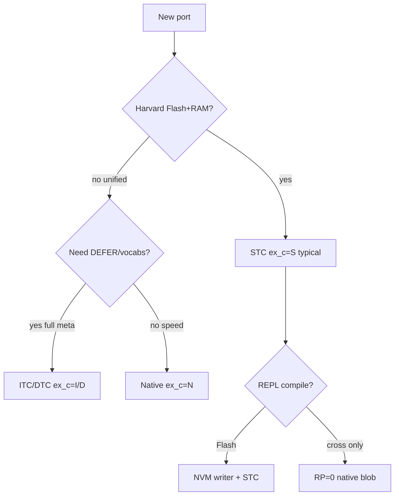

# Threaded Code in Forth

> **Russian:** [FORTH-THREADING.md](FORTH-THREADING.md)

Reference on **colon definition execution models**: what lives in the body of `: foo`, how the inner interpreter works, how ITC differs from DTC and STC, and how this relates to the **EX-C** axis in FMAP.

**Related data and documents:**

| Resource | Purpose |
|----------|---------|
| [`data/forth-threading-models.json`](../data/forth-threading-models.json) | machine-readable model definitions (codes, fields, examples) |
| [`data/forth-fmap-profiles.json`](../data/forth-fmap-profiles.json) | system profiles with the `ex_c` field |
| [`FORTH-SYSTEM-ARCHITECTURE-eng.md`](FORTH-SYSTEM-ARCHITECTURE-eng.md) | FMAP, Harvard, CPU catalog |
| [`sources/gforth-manual/threading.md`](../sources/gforth-manual/threading.md) | Gforth engine: ITC/DTC `NEXT` |

---

## Contents

1. [Terminology](#1-terminology)
2. [Where threading sits in the execution stack](#2-where-threading-sits-in-the-execution-stack)
3. [ITC — indirect threaded code](#3-itc--indirect-threaded-code)
4. [DTC — direct threaded code](#4-dtc--direct-threaded-code)
5. [STC — subroutine threaded code](#5-stc--subroutine-threaded-code)
6. [Other models](#6-other-models)
7. [Comparison table](#7-comparison-table)
8. [Compilation and word body](#8-compilation-and-word-body)
9. [Choosing a model by platform](#9-choosing-a-model-by-platform)
10. [Systems from the catalog](#10-systems-from-the-catalog)
11. [For dataset and model training](#11-for-dataset-and-model-training)

---

## 1. Terminology

| Russian | English | Meaning |
|---------|---------|---------|
| **Шитый код** | threaded code | a sequence of **references to executable fragments** traversed by the engine |
| **Inner interpreter** | inner interpreter | the **`NEXT`** loop that walks the colon word body |
| **Outer interpreter** | outer interpreter | **`INTERPRET`**, text parsing, `STATE`, `: … ;` |
| **CFA** | code field address | code field in the word header |
| **XT** | execution token | CFA address (in ITC terminology) |
| **IP** | instruction pointer | pointer to the current cell in the body of `: foo` |
| **CA** | code address | address of machine code (`docol`, primitive, …) |
| **Примитив** | primitive | a word whose body is **asm**, not a list of xt |

**Important:** “threaded code” ≠ “bytecode VM”. STC on STM8 is a **chain of native `CALL`s**, not interpretation of opcodes from an array.

---

## 2. Where threading sits in the execution stack

```
Console text
       ↓
  EX-O   outer: INTERPRET, CREATE, ,
       ↓
  EX-C   colon body: ITC / DTC / STC / native / …   ← this document
       ↓
  EX-P   primitives: asm, DOXCODE, NEXT handler
```

The **EX-C** axis in FMAP encodes exactly the **colon definition body format**. See [`forth-threading-models.json`](../data/forth-threading-models.json) → field `fmap_ex_c`.

---

## 3. ITC — indirect threaded code

**FMAP:** `ex_c = I`  
**English:** Indirect Threaded Code (ITC)

### Body format of `: foo`

A list of **execution tokens** (CFA addresses), terminated by `EXIT` or equivalent:

```
[ xt₁ | xt₂ | xt₃ | … | xt_exit ]
```

### Inner loop (simplified)

```
cfa = *ip++;          \ fetch xt
ca  = *cfa;           \ dereference code field
goto *ca;             \ jump to docol / doprim / …
```

Classic Gforth scheme (with labels-as-values): [`sources/gforth-manual/threading.md`](../sources/gforth-manual/threading.md).

### Word header

```
name | link | cfa → [ code_address ]
body …
```

CFA points to a **cell** containing the code address. Hence “indirect”: IP → CFA → CA.

### Properties

| + | − |
|---|---|
| `DEFER`/`IS`, vocabs, late binding come naturally | two indirections per word |
| single xt for `'`, `EXECUTE`, `COMPILE,` | slower than DTC/STC |
| historically dominant in desktop Forth | rare on Harvard MCUs |

**Typical systems:** Gforth (engine), FIG-Forth, eForth bootstrap (reference).

---

## 4. DTC — direct threaded code

**FMAP:** `ex_c = D`  
**English:** Direct Threaded Code (DTC)

### Body format

A list of **code addresses** (no intermediate CFA at execution time):

```
[ ca₁ | ca₂ | ca₃ | … | ca_exit ]
```

### Inner loop

```
ca = *ip++;
goto *ca;
```

One level of indirection less than ITC.

### Word header

CFA **is itself** the first code address or points directly to entry (`docol`).

### Properties

| + | − |
|---|---|
| faster than ITC on the same CPU | `EXECUTE` is harder (workaround needed) |
| simpler inner loop | `COMPILE,` and meta differ from ITC |
| Gforth can switch DTC/ITC (`threading-method`) | Harvard: code addrs in Flash, data in RAM — needs care |

**Typical systems:** some hosted Forth systems, certain retro ports; Gforth can build a DTC image.

---

## 5. STC — subroutine threaded code

**FMAP:** `ex_c = S`  
**English:** Subroutine Threaded Code (STC), also **subroutine calling**, **call threading**

### Body format

Not a list of addresses for `NEXT`, but a **sequence of native calls**:

```
CALL prim₁
CALL prim₂
CALL colon_bar    \ entry into another colon word
…
RET               \ or tail via jmp
```

On 8-bit MCUs often **`CALL`/`CALLR`/`JP`** in Flash, without a register-based inner interpreter.

### Inner loop

**None.** Each colon word is a **subroutine**. “Threading” is done by the **compiler** (`,` / `C,`), not a runtime `NEXT` loop.

### Why STC on embedded

| Reason | Explanation |
|--------|-------------|
| Harvard | code in Flash, data in RAM — STC does not carry data pointers in the code stream like ITC |
| Inner loop size | `NEXT` + IP is expensive on 8-bit; STC pays only for `CALL` |
| Speed | often faster than ITC on small MCUs |
| Flash compile | compiler writes **ready instructions** into NVM |

### STC ≠ bytecode

The body of `: foo` in stm8ef / FlashForth / TaliForth2 is **CPU machine instructions**, not a VM-opcode array. The outer interpreter compiles to an asm sequence; execution is native.

### eForth STC lineage

Ting eForth V2 and derivatives (8051-eForth, stm8ef, many AVR/PIC) use STC. See profiles with `"ex_c": "S"` in [`forth-fmap-profiles.json`](../data/forth-fmap-profiles.json).

---

## 6. Other models

Brief overview — full definitions in [`forth-threading-models.json`](../data/forth-threading-models.json).

| FMAP `ex_c` | Name | Colon word body | Inner loop |
|-------------|------|-----------------|------------|
| **N** | Native | machine code (linear / CFG) | none |
| **V** | Forth-native ISA | stream of Forth-CPU opcodes | CPU pipeline |
| **B** | Bytecode VM | array of VM opcodes | VM dispatch |
| **T** | Token threaded | list of **indices** into token table | `NEXT` over table |
| **H** | Hybrid | mix of STC + ITC/DTC sections | partial |

### Native (`N`)

Compiler generates **linear or CFG machine code** instead of an xt list. Mecrisp-Stellaris with peephole / inline — `ex_c=N`, `nc=3`.

### Forth-native (`V`)

The CPU **is** a Forth machine (J1, NC4016, RTX2000). A “colon word” is an instruction stream; inner interpreter = CPU fetch/decode.

### Bytecode VM (`B`)

Separate virtual machine with an opcode table. **Do not confuse** with STC: opcodes are interpreted by the VM, not the CPU directly.

### Token threaded (`T`)

Size compromise: body holds **indices** (1 byte), table maps token→handler. Rare in modern systems; mentioned in literature.

### DITC (outside FMAP, Gforth-specific)

**Doubly Indirect Threaded Code** — for relocatable images (`gforth-ditc`). Two levels of indirection for image relocation. See Gforth manual `gforthmi`.

---

## 7. Comparison table

| Model | FMAP | Body element | Indirection | Inner loop | Harvard-friendly | Typical class |
|-------|------|--------------|-------------|------------|------------------|---------------|
| ITC | I | xt (CFA) | 2 | yes | ◐ | 2, 4 |
| DTC | D | code addr | 1 | yes | ◐ | 2, 4 |
| STC | S | CALL chain | 0 (call) | **no** | ● | 1, 2 |
| Native | N | machine code | 0 | no | ● | 3, 4 |
| Forth-ISA | V | CPU insn | 0 | CPU | ● | 0 |
| Bytecode | B | VM opcode | VM | VM loop | ◐ | rare |
| Token | T | token index | table | yes | ◐ | legacy |

**Speed (very rough, one CPU):** Native ≈ STC > DTC > ITC > Token > Bytecode interpret.

**Colon word code size:** ITC/DTC more compact in **data**; STC bloats Flash with **instructions**, but removes runtime `NEXT`.

---

## 8. Compilation and word body

What the compiler `,` / `C,` puts in the body when `: foo … ;`:

| Model | Compiler puts in body | Calling `bar` |
|-------|----------------------|---------------|
| ITC | xt of `bar` | `NEXT` → `' bar` → docol |
| DTC | code addr of `bar` | `NEXT` → jump |
| STC | `CALL bar` or rel addr | direct call |
| Native | inline or branch | branch/call |

### Primitive vs colon

| Word type | ITC/DTC | STC |
|-----------|---------|-----|
| Primitive | CA to asm entry | `CALL prim` |
| Colon | xt / CA to `docol` | `CALL docol` or inline chain |
| `CREATE`/`VARIABLE` | xt to `dovar` | `CALL dovar` + offset |

### `DOES>`

On ITC/DTC: CFA → does-handler → dodoes.  
On STC: preamble in Flash + `CALL`/`JP` to runtime does code.

---

## 9. Choosing a model by platform



| Scenario | Recommendation |
|----------|----------------|
| STM8 / AVR / PIC product | **STC** + Flash compile |
| 6502/Z80 retro with REPL | **STC** or ITC (TaliForth2 = STC) |
| Linux Gforth | **ITC/DTC** + native `CODE` |
| Cortex-M performance | **Native** (Mecrisp) |
| FPGA soft-CPU | **V** (cross only) |
| Teaching “classical Forth” | **ITC** (eForth bootstrap) |

More on MM and RP: [`FORTH-SYSTEM-ARCHITECTURE-eng.md`](FORTH-SYSTEM-ARCHITECTURE-eng.md).

---

## 10. Systems from the catalog

Profiles linked to a model (field `ex_c` → [`forth-threading-models.json`](../data/forth-threading-models.json)):

| `id` | `ex_c` | Model | Note |
|------|--------|-------|------|
| `gforth` | I | ITC (engine) | + native CODE, can use DTC in image |
| `eforth-minimal` | I | ITC | reference bootstrap |
| `stm8ef` | S | STC | CALL/CALLR, not VM |
| `flashforth` | S | STC | compile always Flash |
| `amforth` | S | STC | AVR |
| `8051-eforth` | S | STC | eForth V2 |
| `taliforth2` | S | STC | 6502 |
| `cerberus-z80` | S | STC | + Forth-assembler |
| `firth` | S | STC | Z80 |
| `mecrisp-stellaris` | N | Native | peephole, inline |
| `mecrisp-msp430` | N | Native | |
| `j1` | V | Forth-ISA | host cross |
| `mecrisp-ice` | V | Forth-ISA | FPGA |

Full list: [`data/forth-fmap-profiles.json`](../data/forth-fmap-profiles.json).

---

## 11. For dataset and model training

### Stable codes

Use **`ex_c`** from FMAP, not free-form wording:

| Wrong in prompt | Correct |
|-----------------|---------|
| “Forth VM on STM8” | `EX-C=S` STC, native CALL |
| “threaded bytecode” | clarify: ITC xt list **or** VM `B` |
| “inner interpreter everywhere” | only ITC/DTC; STC has **none** |

### JSON for conditioning

```json
{
  "threading": {
    "ex_c": "S",
    "model_id": "stc",
    "inner_loop": false
  }
}
```

Join: `forth-fmap-profiles.json` by system `id` + `forth-threading-models.json` by `fmap_ex_c`.

### System prompt fragment

```text
Execution model: STC (ex_c=S). Colon words are native CALL chains in Flash/RAM.
No NEXT inner interpreter. Not a bytecode VM.
Compiler emits CALL/CALLR, not xt lists.
```

### What to avoid in training

- Confusing **outer** `INTERPRET` and **inner** `NEXT`.
- Assuming `' foo @` (ITC idiom) on an STC system.
- Generating `COMPILE,` meta code for STC without a documented shim.

---

## References

- [Brad Rodriguez — Moving Forth (threading models)](https://www.cambridge.org/core/journals/journal-of-forth-application-and-research)
- [Gforth manual §14.2 Threading](../sources/gforth-manual/threading.md)
- [Gforth threading words §5.28](../sources/gforth-manual/threading-words.md)
- [eForth overview (forth.org)](https://www.forth.org/library/index.htm)

---

*Hand-authored for frules.*
