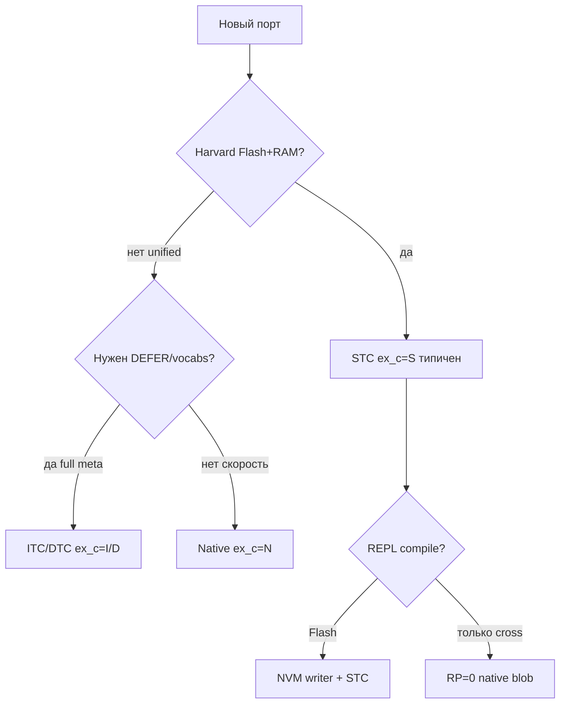

# Шитый код (threaded code) в Forth

> **English:** [FORTH-THREADING-eng.md](FORTH-THREADING-eng.md)

Справочник по **моделям исполнения colon definitions**: что лежит в теле `: foo`, как работает inner interpreter, чем ITC отличается от DTC и STC, и как это связано с осью **EX-C** в FMAP.

**Связанные данные и документы:**

| Ресурс | Назначение |
|--------|------------|
| [`data/forth-threading-models.json`](../data/forth-threading-models.json) | машиночитаемые определения моделей (коды, поля, примеры) |
| [`data/forth-fmap-profiles.json`](../data/forth-fmap-profiles.json) | профили систем с полем `ex_c` |
| [`FORTH-SYSTEM-ARCHITECTURE.md`](FORTH-SYSTEM-ARCHITECTURE.md) | FMAP, Harvard, каталог CPU |
| [`sources/gforth-manual/threading.md`](../sources/gforth-manual/threading.md) | Gforth engine: ITC/DTC `NEXT` |

---

## Содержание

1. [Термины](#1-термины)
2. [Где threading в стеке исполнения](#2-где-threading-в-стеке-исполнения)
3. [ITC — косвенный шитый код](#3-itc--косвенный-шитый-код)
4. [DTC — прямой шитый код](#4-dtc--прямой-шитый-код)
5. [STC — подпрограммный шитый код](#5-stc--подпрограммный-шитый-код)
6. [Другие модели](#6-другие-модели)
7. [Сравнительная таблица](#7-сравнительная-таблица)
8. [Компиляция и тело слова](#8-компиляция-и-тело-слова)
9. [Выбор модели по платформе](#9-выбор-модели-по-платформе)
10. [Системы из каталога](#10-системы-из-каталога)
11. [Для датасета и модели](#11-для-датасета-и-модели)

---

## 1. Термины

| Русский | English | Смысл |
|---------|---------|--------|
| **Шитый код** | threaded code | последовательность **ссылок на исполняемые фрагменты**, которую обходит движок |
| **Inner interpreter** | inner interpreter | цикл **`NEXT`**, который идёт по телу colon word |
| **Outer interpreter** | outer interpreter | **`INTERPRET`**, парсинг текста, `STATE`, `: … ;` |
| **CFA** | code field address | поле кода в заголовке слова |
| **XT** | execution token | адрес CFA (в ITC-терминологии) |
| **IP** | instruction pointer | указатель на текущую ячейку в теле `: foo` |
| **CA** | code address | адрес машинного кода (`docol`, примитив, …) |
| **Примитив** | primitive | слово, тело которого — **asm**, без списка xt |

**Важно:** «шитый код» ≠ «bytecode VM». STC на STM8 — это **цепочка нативных `CALL`**, а не интерпретация opcodes из массива.

---

## 2. Где threading в стеке исполнения

```
Текст на консоли
       ↓
  EX-O   outer: INTERPRET, CREATE, ,
       ↓
  EX-C   colon body: ITC / DTC / STC / native / …   ← этот документ
       ↓
  EX-P   примитивы: asm, DOXCODE, NEXT handler
```

Ось **EX-C** в FMAP кодирует именно **формат тела colon definition**. См. [`forth-threading-models.json`](../data/forth-threading-models.json) → поле `fmap_ex_c`.

---

## 3. ITC — косвенный шитый код

**FMAP:** `ex_c = I`  
**English:** Indirect Threaded Code (ITC)

### Формат тела `: foo`

Список **execution tokens** (адресов CFA), завершается `EXIT` или эквивалентом:

```
[ xt₁ | xt₂ | xt₃ | … | xt_exit ]
```

### Inner loop (упрощённо)

```
cfa = *ip++;          \ взять xt
ca  = *cfa;           \ разыменовать code field
goto *ca;             \ jump в docol / doprim / …
```

Классическая схема Gforth (с labels-as-values): [`sources/gforth-manual/threading.md`](../sources/gforth-manual/threading.md).

### Заголовок слова

```
name | link | cfa → [ code_address ]
body …
```

CFA указывает на **ячейку**, в которой лежит code address. Отсюда «косвенность»: IP → CFA → CA.

### Свойства

| + | − |
|---|---|
| `DEFER`/`IS`, vocabs, late binding естественны | два indirection на слово |
| единый xt для `'`, `EXECUTE`, `COMPILE,` | медленнее DTC/STC |
| исторически доминирует в desktop Forth | на Harvard MCU редок |

**Типичные системы:** Gforth (engine), FIG-Forth, eForth bootstrap (reference).

---

## 4. DTC — прямой шитый код

**FMAP:** `ex_c = D`  
**English:** Direct Threaded Code (DTC)

### Формат тела

Список **code addresses** (без промежуточного CFA при исполнении):

```
[ ca₁ | ca₂ | ca₃ | … | ca_exit ]
```

### Inner loop

```
ca = *ip++;
goto *ca;
```

Один уровень indirection меньше, чем ITC.

### Заголовок слова

CFA **сам является** первым code address или указывает прямо на entry (`docol`).

### Свойства

| + | − |
|---|---|
| быстрее ITC на том же CPU | `EXECUTE` сложнее (нужен обходной путь) |
| проще inner loop | `COMPILE,` и meta отличаются от ITC |
| Gforth может переключать DTC/ITC (`threading-method`) | Harvard: code addrs в Flash, data в RAM — нужна care |

**Типичные системы:** часть hosted Forth, некоторые retro-порты; Gforth может собирать DTC-образ.

---

## 5. STC — подпрограммный шитый код

**FMAP:** `ex_c = S`  
**English:** Subroutine Threaded Code (STC), также **subroutine calling**, **call threading**

### Формат тела

Не список адресов для `NEXT`, а **последовательность нативных вызовов**:

```
CALL prim₁
CALL prim₂
CALL colon_bar    \ вход в другое colon word
…
RET               \ или tail через jmp
```

На 8-bit MCU часто **`CALL`/`CALLR`/`JP`** в Flash, без register-based inner interpreter.

### Inner loop

**Нет.** Каждый colon word — **подпрограмма**. «Сшивание» делается **компилятором** (`,` / `C,`), а не runtime-циклом `NEXT`.

### Почему STC на embedded

| Причина | Пояснение |
|---------|-----------|
| Harvard | code в Flash, данные в RAM — STC не тащит data pointers в code stream как ITC |
| Размер inner loop | `NEXT` + IP на 8-bit дорог; STC платит только за `CALL` |
| Скорость | часто быстрее ITC на малых MCU |
| Flash compile | компилятор пишет **готовые инструкции** в NVM |

### STC ≠ bytecode

Тело `: foo` в stm8ef / FlashForth / TaliForth2 — **машинные инструкции CPU**, не массив VM-opcodes. Outer interpreter компилирует в asm-последовательность; исполнение — нативное.

### eForth STC lineage

Ting eForth V2 и производные (8051-eForth, stm8ef, многие AVR/PIC) используют STC. См. профили с `"ex_c": "S"` в [`forth-fmap-profiles.json`](../data/forth-fmap-profiles.json).

---

## 6. Другие модели

Кратко — полные определения в [`forth-threading-models.json`](../data/forth-threading-models.json).

| FMAP `ex_c` | Название | Тело colon word | Inner loop |
|-------------|----------|-----------------|------------|
| **N** | Native | машинный код (linear / CFG) | нет |
| **V** | Forth-native ISA | поток CPU-opcodes Forth-CPU | CPU pipeline |
| **B** | Bytecode VM | массив VM opcodes | VM dispatch |
| **T** | Token threaded | список **индексов** в token table | `NEXT` по таблице |
| **H** | Hybrid | смесь STC + ITC/DTC участков | частично |

### Native (`N`)

Компилятор генерирует **линейный или CFG машинный код** вместо списка xt. Mecrisp-Stellaris с peephole / inline — `ex_c=N`, `nc=3`.

### Forth-native (`V`)

CPU **является** Forth-машиной (J1, NC4016, RTX2000). «Colon word» — поток insn; inner interpreter = fetch/decode CPU.

### Bytecode VM (`B`)

Отдельная виртуальная машина с opcode table. **Не путать** со STC: opcodes интерпретируются VM, а не CPU напрямую.

### Token threaded (`T`)

Компромисс размера: в теле **индексы** (1 byte), таблица token→handler. Редок в современных системах; упоминается в литературе.

### DITC (вне FMAP, Gforth-specific)

**Doubly Indirect Threaded Code** — для relocatable images (`gforth-ditc`). Два уровня indirection ради перемещения образа. См. Gforth manual `gforthmi`.

---

## 7. Сравнительная таблица

| Модель | FMAP | Элемент тела | Indirection | Inner loop | Harvard-friendly | Типичный класс |
|--------|------|--------------|-------------|------------|------------------|----------------|
| ITC | I | xt (CFA) | 2 | да | ◐ | 2, 4 |
| DTC | D | code addr | 1 | да | ◐ | 2, 4 |
| STC | S | CALL chain | 0 (call) | **нет** | ● | 1, 2 |
| Native | N | machine code | 0 | нет | ● | 3, 4 |
| Forth-ISA | V | CPU insn | 0 | CPU | ● | 0 |
| Bytecode | B | VM opcode | VM | VM loop | ◐ | rare |
| Token | T | token index | table | да | ◐ | legacy |

**Скорость (очень грубо, один CPU):** Native ≈ STC > DTC > ITC > Token > Bytecode interpret.

**Размер кода colon word:** ITC/DTC компактнее в **data**; STC раздувает Flash **инструкциями**, но убирает runtime `NEXT`.

---

## 8. Компиляция и тело слова

Что делает компилятор `,` / `C,` при `: foo … ;`:

| Модель | Компилятор кладёт в body | Вызов `bar` |
|--------|--------------------------|-------------|
| ITC | xt of `bar` | `NEXT` → `' bar` → docol |
| DTC | code addr of `bar` | `NEXT` → jump |
| STC | `CALL bar` или rel addr | прямой call |
| Native | inline или branch | branch/call |

### Примитив vs colon

| Тип слова | ITC/DTC | STC |
|-----------|---------|-----|
| Примитив | CA на asm entry | `CALL prim` |
| Colon | xt / CA на `docol` | `CALL docol` или inline chain |
| `CREATE`/`VARIABLE` | xt на `dovar` | `CALL dovar` + offset |

### `DOES>`

На ITC/DTC: CFA → does-handler → dodoes.  
На STC: преамбула в Flash + `CALL`/`JP` на runtime does-код.

---

## 9. Выбор модели по платформе



| Сценарий | Рекомендация |
|----------|--------------|
| STM8 / AVR / PIC product | **STC** + Flash compile |
| 6502/Z80 retro с REPL | **STC** или ITC (TaliForth2 = STC) |
| Linux Gforth | **ITC/DTC** + native `CODE` |
| Cortex-M performance | **Native** (Mecrisp) |
| FPGA soft-CPU | **V** (cross only) |
| Teaching «классический Forth» | **ITC** (eForth bootstrap) |

Подробнее про MM и RP: [`FORTH-SYSTEM-ARCHITECTURE.md`](FORTH-SYSTEM-ARCHITECTURE.md).

---

## 10. Системы из каталога

Профили с привязкой к модели (поле `ex_c` → [`forth-threading-models.json`](../data/forth-threading-models.json)):

| `id` | `ex_c` | Модель | Заметка |
|------|--------|--------|---------|
| `gforth` | I | ITC (engine) | + native CODE, может DTC в образе |
| `eforth-minimal` | I | ITC | reference bootstrap |
| `stm8ef` | S | STC | CALL/CALLR, не VM |
| `flashforth` | S | STC | compile always Flash |
| `amforth` | S | STC | AVR |
| `8051-eforth` | S | STC | eForth V2 |
| `taliforth2` | S | STC | 6502 |
| `cerberus-z80` | S | STC | + Forth-assembler |
| `firth` | S | STC | Z80 |
| `mecrisp-stellaris` | N | Native | peephole, inline |
| `mecrisp-msp430` | N | Native | |
| `j1` | V | Forth-ISA | host cross |
| `mecrisp-ice` | V | Forth-ISA | FPGA |

Полный список: [`data/forth-fmap-profiles.json`](../data/forth-fmap-profiles.json).

---

## 11. Для датасета и модели

### Стабильные коды

Использовать **`ex_c`** из FMAP, не вольные формулировки:

| Неверно в промпте | Верно |
|-------------------|-------|
| «Forth VM on STM8» | `EX-C=S` STC, native CALL |
| «threaded bytecode» | уточнить: ITC xt list **или** VM `B` |
| «inner interpreter everywhere» | только ITC/DTC; STC его **нет** |

### JSON для conditioning

```json
{
  "threading": {
    "ex_c": "S",
    "model_id": "stc",
    "inner_loop": false
  }
}
```

Join: `forth-fmap-profiles.json` по `id` системы + `forth-threading-models.json` по `fmap_ex_c`.

### System prompt fragment

```text
Execution model: STC (ex_c=S). Colon words are native CALL chains in Flash/RAM.
No NEXT inner interpreter. Not a bytecode VM.
Compiler emits CALL/CALLR, not xt lists.
```

### Чего избегать при обучении

- Путать **outer** `INTERPRET` и **inner** `NEXT`.
- Assumировать `' foo @` (ITC idiom) на STC-системе.
- Генерировать `COMPILE,` meta-код для STC без документированного shim.

---

## Ссылки

- [Brad Rodriguez — Moving Forth (threading models)](https://www.cambridge.org/core/journals/journal-of-forth-application-and-research)
- [Gforth manual §14.2 Threading](../sources/gforth-manual/threading.md)
- [Gforth threading words §5.28](../sources/gforth-manual/threading-words.md)
- [eForth overview (forth.org)](https://www.forth.org/library/index.htm)

---

*Hand-authored для frules. Коды осей согласованы с [`forth-threading-models.json`](../data/forth-threading-models.json) и [`forth-fmap-profiles.json`](../data/forth-fmap-profiles.json).*
